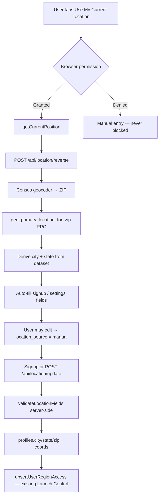

# Smart Location System Report

## Summary

Production-ready GPS + manual location flow with **ZIP as canonical value**, integrated with existing Launch Control (no duplicate region logic).

## Location Flow



## Files Added

| Path | Purpose |
|------|---------|
| `shared/location.ts` | Types, state helpers, service radius options |
| `shared/location.test.ts` | State resolution tests |
| `supabase/migrations/20250704120000_smart_location.sql` | Profile geo columns, cache table, ZIP RPC |
| `api/_lib/location/reverseGeocode.ts` | Census + Nominatim + cache + validation |
| `api/_lib/handlers/locationReverse.ts` | Public reverse geocode endpoint |
| `api/_lib/handlers/locationUpdate.ts` | Authenticated save + launch sync |
| `client/lib/location/geolocation.ts` | Browser GPS with error handling |
| `client/lib/location/locationApi.ts` | Client API wrappers |
| `client/components/location/LocationPicker.tsx` | Signup location UX |
| `client/components/location/LocationSettingsPanel.tsx` | Dashboard location settings |
| `client/components/location/LocationPromptBanner.tsx` | One-time banner for missing location |

## Files Modified

- `api/platform/[action].ts`, `vercel.json` — routes
- `api/_lib/handlers/authSignup.ts` — location validation + persistence
- `client/pages/FamilyRegistration.tsx`, `ChefRegistration.tsx` — LocationPicker
- `client/pages/Dashboard.tsx`, `ChefDashboard.tsx` — settings + banner
- `client/services/auth.service.ts`, `client/lib/securityApi.ts`
- `client/lib/supabase/database.types.ts`

## Database Changes

**profiles:** `country`, `latitude`, `longitude`, `location_source`, `last_location_update`  
**chef_profiles:** `service_radius_miles` (5/10/20/30/50)  
**geo_reverse_cache:** rounded lat/lng → ZIP/city/state  
**RPC:** `geo_primary_location_for_zip(p_zip)` — ZIP-first city/state lookup

## New APIs

| Endpoint | Auth | Purpose |
|----------|------|---------|
| `POST /api/location/reverse` | None (rate limited) | lat/lng → ZIP → city/state |
| `POST /api/location/update` | Bearer | Save location + refresh Launch Control |

## Performance

- Reverse geocode cached per ~111m grid cell
- No Google Maps bundle on signup
- Geolocation only on explicit button click
- Single API call per detection

## QA Notes

- Manual entry always available when GPS denied/unavailable
- Signup never blocked by geolocation failure
- Existing users with state/city/zip unaffected (no banner)
- Launch Control unchanged — uses same `resolveUserRegion` path

## Known Limitations

1. Reverse geocode optimized for **US** (Census primary)
2. Service radius stored but not used in booking/discovery yet
3. Apply migration `20250704120000` before production use

## Verification

```bash
pnpm typecheck
pnpm test
pnpm build
npx supabase db push
git push origin main
```
