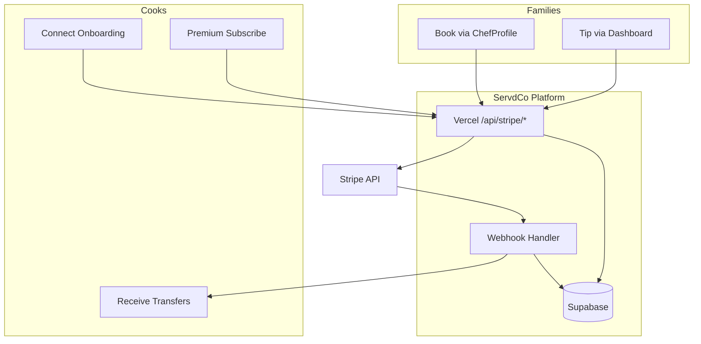

# ServdCo Stripe Implementation Report

**Date:** 2025-06-05  
**Architecture:** Stripe Connect Express · Separate Charges & Transfers · Hosted Checkout  
**Status:** Production-ready (code complete; enable flags + Vercel cron secret to go live)

---

## 1. Architecture Overview



| Flow | Charge destination | Platform fee | Cook payout |
|------|-------------------|--------------|-------------|
| Booking | Platform balance | 13% (configurable) | Transfer after hold |
| Tip | Platform balance | 0% | Immediate transfer |
| Premium | Platform (subscription) | 100% to ServdCo | N/A |

---

## 2. Module Map

| Module | Purpose |
|--------|---------|
| `lib/stripe/server.ts` | Stripe singleton (`STRIPE_SECRET_KEY`) |
| `lib/stripe/client.ts` | Documents Hosted Checkout (no publishable key) |
| `lib/stripe/env.ts` | Env validation + premium ID vars |
| `lib/stripe/helpers.ts` | Idempotency, logging, amount verification |
| `lib/stripe/connect.ts` | Express accounts + account links |
| `lib/stripe/customers.ts` | `getOrCreateStripeCustomer`, `findStripeCustomer`, `updateStripeCustomer` |
| `lib/stripe/checkout.ts` | Booking checkout sessions |
| `lib/stripe/subscription.ts` | Premium subscription checkout |
| `lib/stripe/tips.ts` | Tip checkout + 100% transfer |
| `lib/stripe/transfers.ts` | Scheduled transfer processing |
| `lib/stripe/refund.ts` | Admin refunds |
| `lib/stripe/webhooks.ts` | Webhook export surface |
| `lib/stripe/webhook-handlers.ts` | Event business logic |
| `lib/stripe/events.ts` | Idempotency + `stripe_events` |
| `lib/stripe/fees.ts` | Platform fee from `platform_settings` |
| `lib/stripe/premium.ts` | `premium_status` sync |

---

## 3. API Routes

| Route | Method | Auth | Phase |
|-------|--------|------|-------|
| `/api/stripe/create-checkout-session` | POST | Family JWT | 4 |
| `/api/stripe/subscription/checkout-session` | POST | Chef JWT | 7 |
| `/api/stripe/tips/create-checkout-session` | POST | Family JWT | 8 |
| `/api/stripe/connect/onboarding` | POST | Chef JWT | 3 |
| `/api/stripe/connect/dashboard-link` | POST | Chef JWT | 3 |
| `/api/stripe/webhook` | POST | Stripe signature | 5 |
| `/api/stripe/transfers/process` | GET or POST | `CRON_SECRET` (Vercel Cron GET) or Admin JWT | 9 |
| `/api/stripe/refund` | POST | Admin JWT | 11 |

All user-facing routes use rate limiting (`api/_lib/rateLimit.ts`).

---

## 4. Premium Product / Price IDs

| Source | Priority | Your values |
|--------|----------|-------------|
| `STRIPE_PREMIUM_PRICE_ID` env | 1 (highest) | `price_1ThCVTA4ZMjGNuZkpNssZ6Eq` |
| `STRIPE_PREMIUM_PRODUCT_ID` env | 1 | `prod_UgZe8PbNHRxQm4` |
| `platform_settings` DB | 2 | Synced from env on subscription checkout |

**Vercel:** Set both `STRIPE_PREMIUM_*` env vars in Production and Preview.  
**Migration 21** also seeds these into `platform_settings` for cloud Supabase.

---

## 5. Webhook Event Mapping

| Event | Handler | Effect |
|-------|---------|--------|
| `checkout.session.completed` | Booking / tip routing | Confirm payment or tip |
| `payment_intent.succeeded` | Payment + tip | Status sync |
| `payment_intent.payment_failed` | Payment + tip | Failed + notify |
| `charge.refunded` | Booking + tip | Refund status |
| `account.updated` | Connect sync | `charges_enabled`, `payouts_enabled` |
| `customer.subscription.created` | Premium | `premium_status=true` |
| `customer.subscription.updated` | Premium | Sync status |
| `customer.subscription.deleted` | Premium | `premium_status=false` |
| `invoice.paid` | Premium renewal | Notify cook |
| `invoice.payment_failed` | Premium dunning | Notify cook |
| `transfer.created` | Transfer ledger | Mark transfer paid |
| `payout.paid` | Cook bank payout | `cook_payouts` (when metadata present) |

**Idempotency:** `stripe_events.stripe_event_id` UNIQUE + `claimStripeEvent()`.

---

## 6. Database Tables

| Table | Role |
|-------|------|
| `stripe_customers` | Family/cook Stripe customer IDs |
| `stripe_accounts` | Connect Express accounts |
| `stripe_events` | Webhook idempotency log |
| `payments` | Booking payment ledger |
| `tips` | Tip ledger |
| `transfers` | Platform → cook transfers |
| `cook_payouts` | Connect bank payouts |
| `subscriptions` | Premium membership |
| `platform_settings` | Fee %, premium IDs, hold hours |

**Migration 21:** Premium Stripe IDs + premium-gated analytics RLS.

---

## 7. Security

| Control | Implementation |
|---------|----------------|
| RBAC | JWT on all routes; admin on refund/transfers |
| Rate limiting | 30 req/min per IP per route |
| Input validation | Zod schemas on all POST bodies |
| Amount verification | `verifyCheckoutAmountCents` on webhook |
| Idempotency | Stripe idempotency keys + `stripe_events` |
| No client amounts | Tips/bookings use server-side DB prices |
| Premium analytics | RLS requires `premium_status=true` |

---

## 8. Environment Variables

### Required (Vercel Production)

```
STRIPE_SECRET_KEY=sk_live_...
STRIPE_WEBHOOK_SECRET=whsec_...
STRIPE_PREMIUM_PRODUCT_ID=prod_UgZe8PbNHRxQm4
STRIPE_PREMIUM_PRICE_ID=price_1ThCVTA4ZMjGNuZkpNssZ6Eq
SUPABASE_URL=...
SUPABASE_SERVICE_ROLE_KEY=...
ENABLE_STRIPE_CHECKOUT=true
CRON_SECRET=<random>
VITE_ENABLE_STRIPE_CHECKOUT=true
VITE_SUPABASE_URL=...
VITE_SUPABASE_ANON_KEY=...
```

### Not required

- `STRIPE_CONNECT_CLIENT_ID` — OAuth only; ServdCo uses account links
- `pk_*` publishable key — Hosted Checkout only

---

## 9. Testing Checklist

| # | Test | Command / Action |
|---|------|------------------|
| 1 | Unit tests | `pnpm test lib/stripe` |
| 2 | Typecheck | `pnpm typecheck` |
| 3 | Chef Connect onboarding | Chef dashboard → Earnings → Connect |
| 4 | Premium purchase | Chef dashboard → Premium → Checkout |
| 5 | Family booking pay | Book cook → Stripe Checkout |
| 6 | Webhook delivery | Stripe Dashboard → Events |
| 7 | Booking confirmed | `bookings.status=confirmed` |
| 8 | Transfer after hold | Complete booking → wait hold → cron |
| 9 | Tip payment | Completed booking → tip prompt |
| 10 | Admin refund | Admin → Payouts → Refund button |
| 11 | Subscription cancel | Stripe customer portal or Dashboard |
| 12 | Webhook replay | Resend event → skipped as duplicate |

---

## 10. Deployment Checklist

- [ ] Set all Vercel env vars (§8)
- [ ] Register webhook: `https://<domain>/api/stripe/webhook`
- [ ] Enable `enable_stripe_checkout` in Supabase `feature_flags`
- [ ] Run migration 21: `supabase db push`
- [ ] Set `CRON_SECRET` in Vercel (matches cron auth header)
- [ ] Verify Vercel cron in `vercel.json` (hourly transfers)
- [ ] Test mode E2E before switching to live keys
- [ ] Confirm Connect Express enabled in Stripe Dashboard

---

## 11. Known Limitations

| Item | Notes |
|------|-------|
| Partial refund vs transfer | Partial refunds do not auto-adjust transfer amount |
| Tip transfer retry | Tips pending transfer if cook not onboarded need manual re-process |
| Rate limit | Per serverless instance (not global Redis) |
| `cook_payouts` | Requires `chef_profile_id` in Stripe payout metadata |

---

## 12. Phase Completion Matrix

| Phase | Description | Status |
|-------|-------------|--------|
| 1 | Stripe foundation | ✅ |
| 2 | Customer management | ✅ |
| 3 | Connect onboarding | ✅ |
| 4 | Booking checkout | ✅ |
| 5 | Webhook system | ✅ |
| 6 | Booking payment success | ✅ |
| 7 | Premium subscriptions | ✅ |
| 8 | Tip payments | ✅ |
| 9 | Transfer engine | ✅ |
| 10 | Hold period logic | ✅ (DB trigger) |
| 11 | Refund system | ✅ (+ admin UI) |
| 12 | Admin financial dashboard | ✅ |
| 13 | Notifications | ✅ |
| 14 | Security | ✅ |
| 15 | Testing + this report | ✅ |
