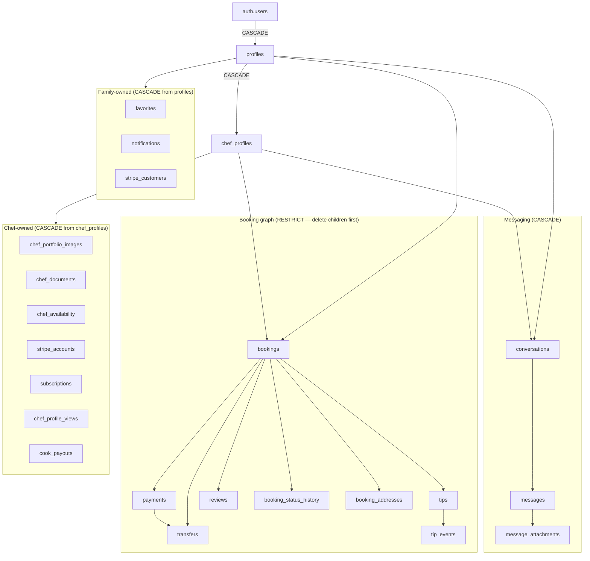

# ServdCo Database Portability & Beta Cleanup Audit

**Date:** 2026-06-12  
**Scope:** Full schema review, migration portability, beta user cleanup  
**Goal:** Repository is the single source of truth; a fresh Supabase project becomes production-ready via migrations only.

---

## Executive Summary

| Area | Status | Action |
|------|--------|--------|
| Schema in migrations | ✅ Complete (32 tables) | None |
| Storage buckets/policies | ✅ In migrations | None |
| RLS + FORCE RLS | ✅ In migrations | None |
| Geo ZIP reference data | ✅ Migration seed | None |
| Launch regions | ⚠️ Was seed.sql only | **Fixed:** `20250625100000_production_reference_seed.sql` |
| Feature flags rows | ⚠️ Was seed.sql only | **Fixed:** same migration |
| Dev users in repo | ⚠️ `seed-dev-chefs.sql` | Dev-only script, never run in prod |
| Beta test users in DB | 🔧 Manual cleanup | Run `supabase/scripts/beta-cleanup-test-users.sql` |
| Stripe external objects | ⚠️ Not in SQL | Post-cleanup Stripe dashboard/API |

---

## 1. Database Dependency Map

### 1.1 Entity hierarchy (auth → marketplace)



### 1.2 Deletion order (beta cleanup)

| Step | Tables | FK note |
|------|--------|---------|
| 1 | `message_attachments` | CASCADE from messages |
| 2 | `messages` | CASCADE from conversations |
| 3 | `conversations` | CASCADE from profiles/chef |
| 4 | `tip_events` | CASCADE from tips |
| 5 | `tips` | RESTRICT — before bookings |
| 6 | `cook_payouts` | CASCADE / transfer FK |
| 7 | `transfers` | RESTRICT |
| 8 | `payments` | RESTRICT |
| 9 | `reviews` | RESTRICT |
| 10 | `booking_status_history`, `booking_addresses` | CASCADE |
| 11 | `bookings` | Parent of payment graph |
| 12 | `chef_profile_views`, `favorites`, `notifications` | User-owned |
| 13 | `chef_portfolio_images`, `chef_documents`, `chef_availability` | Chef-owned |
| 14 | `subscriptions`, `stripe_accounts`, `stripe_customers` | Stripe mappings |
| 15 | `waitlist_signups` | profile_id / email |
| 16 | `storage.objects` | avatars, portfolio, documents, attachments |
| 17 | `audit_logs`, `security_events` | Hygiene (actor/user FK SET NULL) |
| 18 | `chef_profiles` | Before profiles |
| 19 | `profiles` | Before auth |
| 20 | `auth.users` | Final |
| 21 | `launch_regions` counters | Resync from waitlist |

### 1.3 Tables with NO user deletion (preserved)

| Table | Reason |
|-------|--------|
| `launch_regions` | Platform config |
| `platform_settings` | Platform config |
| `feature_flags` | Platform config |
| `geo_city_zip_codes` | Reference data |
| `blog_posts` | Content |
| `interest_requests` | Anonymous leads |
| `contact_messages` | Support inbox (no profile FK on submit) |
| `stripe_events` | Webhook audit log |
| `audit_logs` (non-test actors) | Platform audit trail |

---

## 2. Schema Audit

### 2.1 Tables (32)

| Domain | Tables |
|--------|--------|
| **Auth/Profiles** | `profiles`, `chef_profiles`, `chef_portfolio_images` |
| **Marketplace** | `bookings`, `booking_status_history`, `booking_addresses`, `reviews`, `favorites`, `notifications`, `chef_documents`, `chef_availability` |
| **Messaging** | `conversations`, `messages`, `message_attachments` |
| **Stripe** | `stripe_customers`, `stripe_accounts`, `payments`, `stripe_events`, `subscriptions`, `transfers`, `cook_payouts`, `tips`, `tip_events` |
| **Launch/Ops** | `launch_regions`, `waitlist_signups`, `interest_requests`, `contact_messages`, `platform_settings`, `blog_posts`, `feature_flags` |
| **Security** | `audit_logs`, `security_events` |
| **Geo** | `geo_city_zip_codes` |
| **Analytics** | `chef_profile_views` |

### 2.2 Extensions

- `pgcrypto`, `uuid-ossp`, `pg_trgm` — migration `01_extensions_enums`

### 2.3 Enums (18)

`user_role`, `account_status`, `verification_status`, `profile_visibility`, `admin_visibility_override`, `service_type`, `booking_status`, `document_type`, `document_status`, `notification_type`, `interest_role`, `waitlist_role`, `contact_status`, `payment_status`, `stripe_onboarding_status`, `subscription_status`, `message_status`, `transfer_status`, `tip_status`

### 2.4 Views

- `profiles_marketplace_public` — limited chef PII for marketplace

### 2.5 RPCs

- `search_geo_cities(state, query, limit)`
- `geo_zips_for_cities(state, cities[])`

### 2.6 Storage

| Bucket | Public | Path convention |
|--------|--------|-----------------|
| `avatars` | yes | `{user_id}/{file}` |
| `cook-portfolio` | yes | `{chef_profile_id}/{file}` |
| `cook-documents` | no | `{chef_profile_id}/{doc_type}/{file}` |
| `message-attachments` | no | `{user_id}/...` |

All buckets and policies: migration `11_storage_buckets` + `28_booking_operations`.

### 2.7 Realtime publication

`messages`, `conversations`, `notifications`, `bookings`, `chef_profiles`, `chef_documents`, `payments`, `transfers`  
`REPLICA IDENTITY FULL` on dashboard tables.

---

## 3. Migration Audit

### 3.1 Inventory

- **37** timestamped migrations + **1 new** reference seed = **38** total
- Ordered chronologically under `supabase/migrations/`
- No duplicate timestamps detected
- No conflicting `CREATE TABLE` for same object

### 3.2 Migration chain health

| Check | Result |
|-------|--------|
| Extensions before tables | ✅ |
| Tables before RLS | ✅ |
| RLS before storage policies | ✅ |
| Auth trigger after profiles | ✅ |
| Geo table before geo seed | ✅ |
| Booking enum extension before workflow body | ✅ |

### 3.3 Gaps found (fixed in this PR)

| Gap | Impact on fresh `db push` | Fix |
|-----|--------------------------|-----|
| `launch_regions` only in `seed.sql` | Empty regions table | `20250625100000_production_reference_seed.sql` |
| `feature_flags` rows only in `seed.sql` | UPDATE migrations no-op; auth/stripe off | Same migration |
| `seed.sql` runs only on `db reset` | Client project never gets seed | Migration + optional `run-cloud-seed.mjs` deprecated for prod |

### 3.4 Migrations that are NOT schema (data/cleanup)

| Migration | Type | Safe on fresh project |
|-----------|------|----------------------|
| `25_cleanup_dev_chefs` | Soft-delete dev patterns | ✅ Idempotent UPDATE |
| `22_production_launch` | ENABLE flags | ✅ Requires flag rows (now seeded) |
| `21_premium_stripe_ids` | Live Stripe IDs | ✅ UPDATE only |
| `23100001_geo_city_zip_seed` | 943 ZIP rows | ✅ INSERT ON CONFLICT |

### 3.5 Dev-only artifacts (not migrations)

| File | Purpose | Production |
|------|---------|------------|
| `supabase/seed-dev-chefs.sql` | 5 fake chefs | **Never run** |
| `supabase/seed.sql` | Local dev reference | Optional via `db reset` only |
| `supabase/scripts/beta-cleanup-test-users.sql` | Beta cleanup | **Run once** before launch |

---

## 4. Missing Objects (before fix)

| Object | Was missing from migrations | Now |
|--------|----------------------------|-----|
| `launch_regions` rows | Yes | ✅ Migration `20250625100000` |
| `feature_flags` rows | Yes | ✅ Same |
| GA / WA launch regions | Not in seed.sql | ✅ Added to migration |
| Albany in NY zip list | Partial | ✅ Added `12207` |

---

## 5. Objects That May Exist Only in Dashboard

Verify in Supabase dashboard → compare to migrations:

| Object type | In repo? | Dashboard check |
|-------------|----------|-----------------|
| Tables/views | ✅ All in migrations | Should match |
| RLS policies | ✅ | Re-run policy diff if unsure |
| Storage buckets | ✅ | 4 buckets |
| Auth providers | N/A | Email provider settings (not SQL) |
| Auth email templates | N/A | Supabase Auth → Email templates |
| Realtime | ✅ | Publication matches migration 29 |
| Database webhooks | ? | Check if any manual webhooks exist |
| Edge functions | N/A | Not used (Vercel API) |
| Custom roles | N/A | Default anon/authenticated/service_role |

**Action for client handoff:** Export dashboard settings checklist (Auth URLs, SMTP/Resend, redirect URLs) — these are env/dashboard, not migrations.

---

## 6. Required Migration Fixes

| Fix | Status |
|-----|--------|
| Add `20250625100000_production_reference_seed.sql` | ✅ Created |
| Keep `vercel.json` includeFiles as string | ✅ (prior fix) |

**Not recommended:** Editing old migrations already applied to dev project — use forward-only migration.

---

## 7. Seed Scripts

| Script | When to run | Contains users? |
|--------|-------------|-------------------|
| `migrations/*.sql` | `supabase db push` | No users |
| `migrations/23100001_geo_city_zip_seed.sql` | Auto with push | No |
| `migrations/20250625100000_production_reference_seed.sql` | Auto with push | No |
| `seed.sql` | Local `db reset` only | No users (metadata only) |
| `seed-dev-chefs.sql` | Local dev via script | **Yes — dev only** |
| `beta-cleanup-test-users.sql` | Pre-launch once | Deletes users |

---

## 8. Fresh Project Verification Workflow

```bash
# 1. Client creates Supabase project
# 2. Clone repo, link project
supabase login
supabase link --project-ref <CLIENT_REF>

# 3. Apply all migrations
supabase db push

# 4. Verify reference data
# SQL: SELECT COUNT(*) FROM launch_regions;        -- expect 7
# SQL: SELECT key, enabled FROM feature_flags;     -- auth/stripe/messaging true
# SQL: SELECT COUNT(*) FROM geo_city_zip_codes;    -- expect 943+

# 5. Generate types
pnpm exec supabase gen types typescript --linked > client/lib/supabase/database.types.ts

# 6. Configure env (Vercel + .env.local)
# SUPABASE_URL, SUPABASE_ANON_KEY, SUPABASE_SERVICE_ROLE_KEY
# STRIPE_*, RESEND_*, TURNSTILE_*

# 7. Promote Alexandria admin AFTER she signs up:
UPDATE public.profiles
SET role = 'admin', status = 'active'
WHERE lower(email) = 'alexandria@servdco.com';
```

---

## 9. Beta Cleanup Instructions

**Script:** `supabase/scripts/beta-cleanup-test-users.sql`

### Preserve list (edit before run)

```sql
v_preserve_emails := ARRAY['alexandria@servdco.com'];
```

If Alexandria used the same email for a Family test account AND admin, **only the admin profile is preserved** — the script excludes `v_preserve_emails` regardless of role. Verify her admin email in:

```sql
SELECT id, email, role FROM public.profiles WHERE role = 'admin';
```

### Modes

| `v_explicit_only` | Behavior |
|-------------------|----------|
| `true` | Delete only `v_extra_delete_emails` + patterns |
| `false` | Delete **all** family/chef except preserve list |

**Recommended:** Run preview with `v_explicit_only := true` first, then `false` if you want a full sweep.

### Post-SQL (Stripe — not in database)

For each deleted email, in Stripe Dashboard (test or live):

1. **Customers** → search email → delete test customer
2. **Connect** → delete test Express/Standard accounts for dev cooks
3. Do **not** delete platform webhook endpoints or live products

---

## 10. FK Reference Quick Reference

### ON DELETE RESTRICT (must delete children first)

- `bookings` ← `payments`, `reviews`, `tips`, `transfers`
- `profiles` ← `bookings.family_id`, `payments.family_id`, `reviews.family_id`, `tips.family_id`
- `chef_profiles` ← same pattern for chef side

### ON DELETE CASCADE (auto with parent)

- `auth.users` → `profiles`
- `profiles` → `chef_profiles`, `notifications`, `favorites`, `stripe_customers`, `conversations.family_id`, `messages.sender_id`

---

## 11. Going Forward (hard requirement)

1. **Every** schema change → new file in `supabase/migrations/`
2. **Reference data** → migration or documented seed script (not dashboard edits)
3. **Never** commit real user emails to migrations
4. Run `supabase db push` on dev, then client project
5. Regenerate `database.types.ts` after schema changes

---

## Files Delivered

| File | Purpose |
|------|---------|
| `docs/DATABASE_PORTABILITY_AUDIT.md` | This document |
| `supabase/scripts/beta-cleanup-test-users.sql` | Production-safe beta cleanup |
| `supabase/migrations/20250625100000_production_reference_seed.sql` | Portable reference data |
