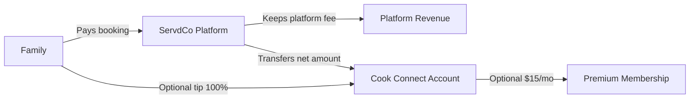
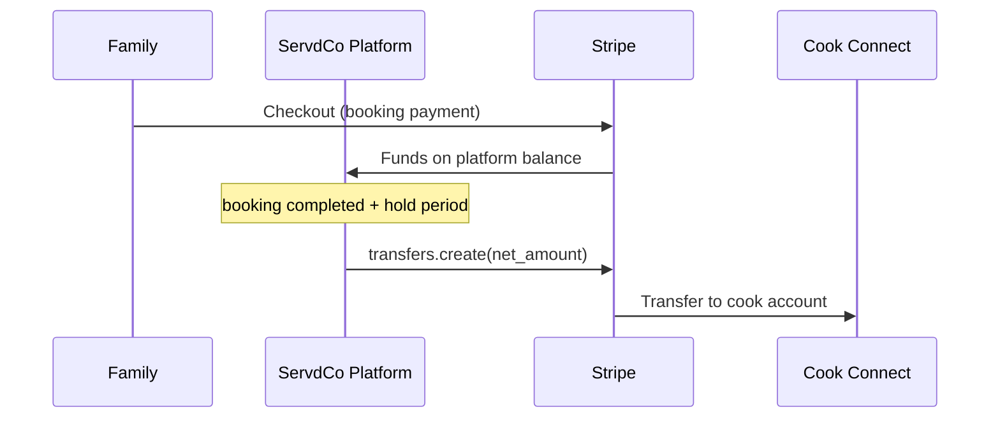
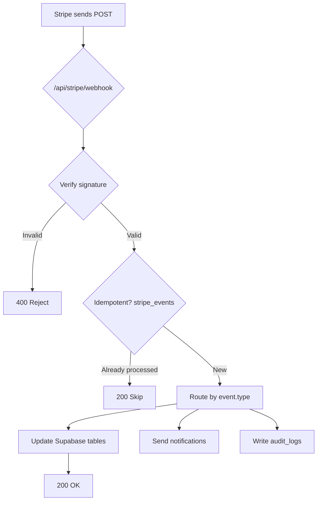
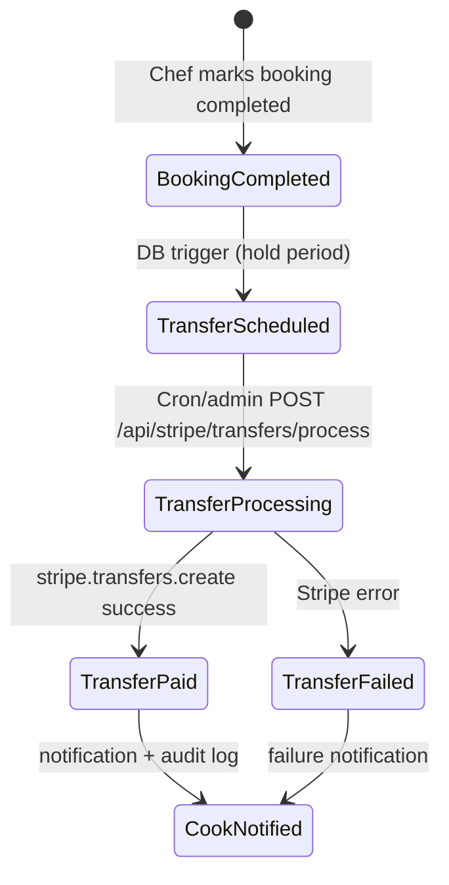
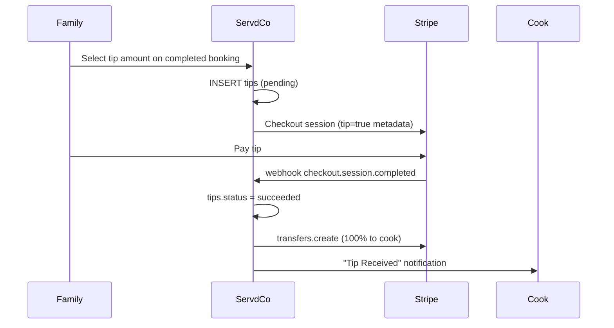

# ServdCo Stripe Dashboard Setup & Operations Handbook

**Document:** `docs/servdco-stripe-dashboard-setup-guide.md`  
**Audience:** Alexandria (primary admin), developers, future operators  
**Last updated:** 2025-06-05  
**Scope:** Complete Stripe configuration for ServdCo from scratch — no prior project knowledge required

> This is the official Stripe setup and operations handbook for ServdCo.  
> Do not commit secret keys. Do not paste live secrets into tickets or chat.

---

## Table of Contents

1. [ServdCo Business Model](#section-1--servdco-business-model)
2. [Stripe Account Requirements](#section-2--stripe-account-requirements)
3. [Enable Stripe Connect](#section-3--enable-stripe-connect)
4. [Create Premium Membership Product](#section-4--create-premium-membership-product)
5. [Premium Product IDs](#section-5--premium-product-ids)
6. [API Keys](#section-6--api-keys)
7. [Webhook Setup](#section-7--webhook-setup)
8. [Test Mode Checklist](#section-8--test-mode-checklist)
9. [Cook Connect Onboarding](#section-9--cook-connect-onboarding)
10. [Payout System](#section-10--payout-system)
11. [Tip System](#section-11--tip-system)
12. [Refunds](#section-12--refunds)
13. [Live Mode Checklist](#section-13--live-mode-checklist)
14. [ServdCo Environment Variables](#section-14--servdco-environment-variables)
15. [Stripe Troubleshooting](#section-15--stripe-troubleshooting)
16. [ServdCo Stripe E2E Test Plan](#section-16--servdco-stripe-e2e-test-plan)

---

## Section 1 — ServdCo Business Model

### What ServdCo Is

ServdCo is a **two-sided marketplace** connecting **families** who want home-cooked meals with **cooks** (chefs) who provide in-home cooking services.



### Money Flow (Bookings)

1. A **family** books a cook on ServdCo.
2. The family pays **ServdCo** (the platform) via Stripe Checkout.
3. ServdCo retains a **configurable platform fee** (default **13%**).
4. The **cook** receives the remainder via a Stripe Connect transfer after the booking completes and a hold period elapses.

**ServdCo uses Separate Charges & Transfers** — the charge lands on the platform balance first; transfers to cooks are created programmatically.

### Platform Fee Examples (Default 13%)

The fee percentage is stored in Supabase `platform_settings` as `platform_fee_percentage`. Default: **13**. Alexandria can change this in the Admin Dashboard without code changes.

| Service | Gross (Family Pays) | Platform Fee (13%) | Cook Receives |
|---------|---------------------|--------------------|---------------|
| Breakfast | $40.00 | $5.20 | $34.80 |
| Dinner | $60.00 | $7.80 | $52.20 |
| Meal Prep | $70.00 | $9.10 | $60.90 |

**Formula:**

```
platform_fee_cents = round(gross_cents × fee_percent / 100)
cook_payout_cents  = gross_cents - platform_fee_cents
```

### Tips (Optional — Separate from Bookings)

| Rule | Value |
|------|-------|
| Required? | **No** — entirely optional |
| Platform fee on tips | **0%** — ServdCo never takes a cut |
| Cook receives | **100%** of tip amount |
| When shown | After `booking.status = completed`, if no tip already paid |
| Suggested amounts | $5, $10, $15, $20, or custom |

**Example:** Booking $60 → platform keeps $7.80, cook gets $52.20 from booking. Family optionally tips $15 → cook receives **$52.20 + $15.00 = $67.20** total. Platform still only keeps **$7.80**.

### Premium Membership (Optional for Cooks)

| Tier | Price | Who |
|------|-------|-----|
| **Free** | $0 | All cooks — full platform access (bookings, messaging, portfolio, profiles) |
| **Premium** | **$15/month** | Optional upgrade for growth features |

**Premium benefits (no effect on tipping or payouts):**

1. Priority placement in search results
2. Featured Cook badge
3. Booking analytics dashboard
4. Earnings analytics dashboard
5. Profile view analytics

Free cooks retain **full** marketplace functionality. Premium is a growth tool only.

### What Stripe Handles vs What ServdCo Handles

| Function | Stripe | ServdCo (Supabase + Vercel) |
|----------|--------|----------------------------|
| Card processing | ✅ | — |
| Connect onboarding (KYC) | ✅ | Triggers + status sync |
| Subscription billing | ✅ | Entitlement sync via webhooks |
| Platform fee calculation | — | ✅ Server reads `platform_settings` |
| Booking ledger | — | ✅ `payments` table |
| Cook transfers | ✅ `transfers.create` | ✅ Schedules + processes |
| Tips (separate) | ✅ Separate Checkout | ✅ `tips` table, 0% fee |
| Notifications | — | ✅ DB triggers + webhooks |

---

## Section 2 — Stripe Account Requirements

### Required Stripe Account Type

| Requirement | Value |
|-------------|-------|
| Account type | **Standard Stripe account** (platform) |
| Connect model | **Stripe Connect Express** for cooks |
| Charge model | **Separate Charges and Transfers** |
| Country | **United States** (ServdCo default; confirm with legal) |
| Currency | **USD** |

### Stripe Dashboard Roles

Stripe roles are configured at **Settings → Team and security → Team members**.

| Role | Typical Access | Alexandria | Developer |
|------|----------------|------------|-----------|
| **Owner** | Full account, live keys, business verification, bank, tax | ✅ Required | — |
| **Admin** | Most settings, some live restrictions | ✅ Recommended | Optional |
| **Developer** | API keys (test), webhooks (test), Connect view | View only | ✅ Primary |
| **Analyst** | Read-only reports | Optional | — |
| **Support** | Customers, disputes view | Optional | — |

### What Alexandria Must Configure (Owner/Admin)

- [ ] Create Stripe account and complete business verification
- [ ] Add business bank account for platform payouts
- [ ] Enable **Stripe Connect** (Express)
- [ ] Configure business profile, branding, statement descriptor
- [ ] Create **Premium Chef Membership** product + $15/mo price
- [ ] Approve go-live (live mode keys, live webhook)
- [ ] Tax settings (consult accountant)
- [ ] Dispute and refund policy in Dashboard

### What Developers Configure

- [ ] API keys in Vercel environment variables
- [ ] Webhook endpoint URL + signing secret
- [ ] Copy `stripe_product_id` and `stripe_price_id` into Supabase `platform_settings`
- [ ] Enable `enable_stripe_checkout` feature flag in Supabase
- [ ] Schedule transfer processing job (`POST /api/stripe/transfers/process`)
- [ ] Test mode E2E validation (Section 16)

### Screenshots Checklist (Capture During Setup)

| # | Screen | Path in Dashboard |
|---|--------|-------------------|
| 1 | Account activated | Home → account status banner |
| 2 | Connect enabled | Connect → Settings |
| 3 | Express onboarding branding | Connect → Settings → Branding |
| 4 | Premium product created | Products → Premium Chef Membership |
| 5 | Premium price $15/mo | Products → Premium Chef Membership → Pricing |
| 6 | Test API keys | Developers → API keys |
| 7 | Webhook endpoint | Developers → Webhooks → endpoint detail |
| 8 | Webhook signing secret | Developers → Webhooks → Reveal secret |
| 9 | Connect application ID | Connect → Settings → Integration → Client ID |
| 10 | First test payment | Developers → Events → `checkout.session.completed` |

> `[SCREENSHOT PLACEHOLDER: Stripe Dashboard — Connect Settings overview]`

---

## Section 3 — Enable Stripe Connect

### Overview

Stripe Connect allows ServdCo to onboard cooks as **Express connected accounts**. Cooks complete KYC and bank setup in a Stripe-hosted flow. ServdCo never stores cook bank details.

### Step-by-Step: Enable Connect

#### Step 1 — Open Connect Settings

1. Log in to [Stripe Dashboard](https://dashboard.stripe.com)
2. Confirm **Test mode** toggle (top-right) is **ON** for initial setup
3. Click **Connect** in the left sidebar
4. Click **Get started** (first time) or **Settings** (gear icon)

> `[SCREENSHOT PLACEHOLDER: Left sidebar → Connect highlighted]`

#### Step 2 — Choose Account Type

1. When prompted for connected account type, select **Express**
2. **Do not** choose Standard (too much cook-facing Stripe UI) or Custom (too much engineering overhead)

**Why Express for ServdCo:** Cooks get a simple onboarding link from the Chef Dashboard. Stripe handles identity verification and payout bank collection.

#### Step 3 — Configure Connect Branding

1. Navigate: **Connect → Settings → Branding**
2. Set:
   - **Business name shown to connected accounts:** `ServdCo`
   - **Icon / Logo:** Upload ServdCo logo (square, min 128×128 px)
   - **Brand color:** `#FF7A59` (ServdCo accent) or brand guideline color
3. Click **Save**

> `[SCREENSHOT PLACEHOLDER: Connect → Settings → Branding form filled]`

#### Step 4 — Platform Profile

1. Navigate: **Connect → Settings → Platform profile**
2. Complete:
   - **Platform name:** ServdCo
   - **Support email:** support@servdco.com (use real support email)
   - **Support phone:** (optional but recommended)
   - **Platform website:** `https://your-production-domain.com`
3. Save

#### Step 5 — Payout Settings (Platform)

1. Navigate: **Settings → Bank accounts and scheduling → Payouts**
2. Confirm platform bank account is connected (for platform's own revenue)
3. Note default payout schedule (daily/weekly) — this affects platform balance only, not cook transfers

#### Step 6 — Country and Capabilities

1. Navigate: **Connect → Settings → Integration**
2. Confirm **Country:** United States
3. Note the **Connect Client ID** (`ca_...`) — required for ServdCo env var `STRIPE_CONNECT_CLIENT_ID`
4. Under capabilities, ensure **Transfers** are enabled for Express accounts

> `[SCREENSHOT PLACEHOLDER: Connect → Settings → Integration showing Client ID]`

#### Step 7 — Terms of Service

1. Navigate: **Connect → Settings → Terms of service**
2. Choose Stripe-hosted terms OR provide ServdCo marketplace terms URL
3. Cooks must accept terms during Express onboarding

#### Step 8 — Verify Charge Model

ServdCo uses **Separate Charges and Transfers**:

- Family payment → **platform** Stripe balance
- After booking completes + hold period → `stripe.transfers.create` → cook Connect account

**Do not** enable destination charges or direct charges to cook accounts for booking payments.



### Connect Checklist

| Step | Done? |
|------|-------|
| Connect Express enabled | ☐ |
| Branding configured | ☐ |
| Platform profile complete | ☐ |
| Client ID copied (`ca_...`) | ☐ |
| Support email set | ☐ |
| Terms of service configured | ☐ |

---

## Section 4 — Create Premium Membership Product

### Product Overview

| Field | Value |
|-------|-------|
| **Product name** | Premium Chef Membership |
| **Description** | Optional premium plan for cooks on ServdCo. Unlock priority search ranking, Featured Cook badge, and analytics dashboards. |
| **Product type** | Service |
| **Pricing model** | Recurring |
| **Price** | $15.00 USD |
| **Billing period** | Monthly |
| **Setup fee** | None |
| **Free trial** | None |

### Step-by-Step: Create Product

#### Step 1 — Open Products

1. Dashboard → **Product catalog** (or **Products** in sidebar)
2. Click **+ Add product**

> `[SCREENSHOT PLACEHOLDER: Products list → Add product button]`

#### Step 2 — Product Information

| Field | Enter exactly |
|-------|---------------|
| Name | `Premium Chef Membership` |
| Description | `Optional premium plan for cooks on ServdCo. Benefits: priority search ranking, Featured Cook badge, booking analytics, earnings analytics, and profile view analytics. Free tier remains fully functional.` |
| Image | Optional — ServdCo crown/badge icon |
| Tax code | Consult accountant (often `Software as a service` or `General services`) |

#### Step 3 — Pricing

| Field | Enter exactly |
|-------|---------------|
| Pricing model | **Standard pricing** |
| Price | `15.00` |
| Currency | **USD** |
| Billing period | **Monthly** |
| Usage type | Licensed (default) |

**Do not** add:
- Setup fee
- Free trial period
- Annual price (unless explicitly approved later)

Click **Add product**.

> `[SCREENSHOT PLACEHOLDER: New product form with $15/month recurring]`

#### Step 4 — Verify Product

After creation, open the product detail page. Confirm:

- Status: **Active**
- Price: **$15.00 / month**
- Price ID starts with `price_`
- Product ID starts with `prod_`

Copy both IDs — you will need them in Section 5.

### Premium Benefits (Reference for Marketing Copy)

| Benefit | Free Cook | Premium Cook |
|---------|-----------|--------------|
| Receive bookings | ✅ | ✅ |
| Messaging | ✅ | ✅ |
| Portfolio / profile | ✅ | ✅ |
| Priority search ranking | ❌ | ✅ |
| Featured Cook badge | ❌ | ✅ |
| Analytics dashboards | ❌ | ✅ |

---

## Section 5 — Premium Product IDs

### What These IDs Are

| ID | Stripe prefix | Purpose |
|----|---------------|---------|
| `stripe_product_id` | `prod_...` | Identifies the Premium Chef Membership product |
| `stripe_price_id` | `price_...` | Identifies the $15/month recurring price |

### Where to Copy Them in Stripe Dashboard

1. **Dashboard → Product catalog → Premium Chef Membership**
2. Product ID is at the top of the product page (click to copy): `prod_XXXXXXXXXXXXXXXX`
3. Under **Pricing**, click the $15/month price row → Price ID: `price_XXXXXXXXXXXXXXXX`

> `[SCREENSHOT PLACEHOLDER: Product detail showing prod_ and price_ IDs]`

### Where ServdCo Stores Them

ServdCo stores these in Supabase table **`platform_settings`** (not in code):

| `key` | Example value | Description |
|-------|---------------|-------------|
| `stripe_premium_product_id` | `"prod_abc123"` | Stripe Product ID |
| `stripe_premium_price_id` | `"price_xyz789"` | Stripe Price ID |
| `chef_premium_price_monthly_cents` | `1500` | $15.00 — used if price ID not set |

### SQL Examples (Run in Supabase SQL Editor)

**Test mode IDs:**

```sql
UPDATE public.platform_settings
SET value = '"prod_YOUR_TEST_PRODUCT_ID"'::jsonb,
    updated_at = now()
WHERE key = 'stripe_premium_product_id';

UPDATE public.platform_settings
SET value = '"price_YOUR_TEST_PRICE_ID"'::jsonb,
    updated_at = now()
WHERE key = 'stripe_premium_price_id';

-- Verify
SELECT key, value FROM public.platform_settings
WHERE key IN (
  'stripe_premium_product_id',
  'stripe_premium_price_id',
  'chef_premium_price_monthly_cents'
);
```

**Live mode:** Repeat with live-mode `prod_` and `price_` IDs after go-live. Test and live IDs are different.

### Admin Dashboard (Alternative)

1. Log in to ServdCo as **admin** (Alexandria)
2. Navigate: **Admin Dashboard → Platform Settings**
3. Premium price is editable in cents (1500 = $15)
4. Stripe Product/Price IDs: update via Supabase SQL Editor until admin UI fields are added

### How ServdCo Uses These IDs

When a cook clicks **Upgrade to Premium**:

1. Client calls `POST /api/stripe/subscription/checkout-session`
2. Server reads `stripe_premium_price_id` from `platform_settings`
3. If price ID exists → Checkout uses fixed Stripe Price
4. If not → Checkout creates dynamic `price_data` from `chef_premium_price_monthly_cents` (1500)
5. Webhook `customer.subscription.created` → sets `chef_profiles.premium_status = true`

---

## Section 6 — API Keys

### Key Types Explained

| Key | Prefix | Exposure | Purpose |
|-----|--------|----------|---------|
| **Publishable key** | `pk_test_` / `pk_live_` | Client-safe | Stripe.js (ServdCo uses server-side Checkout redirects — limited client use) |
| **Secret key** | `sk_test_` / `sk_live_` | **Server only** | Create Checkout, transfers, refunds, webhooks |
| **Webhook signing secret** | `whsec_` | **Server only** | Verify webhook authenticity |
| **Connect Client ID** | `ca_` | Server/config | Identify Connect application |

### Test vs Live

| Mode | Toggle | Keys prefix | Use for |
|------|--------|-------------|---------|
| **Test** | Test mode ON (orange) | `pk_test_`, `sk_test_` | Development, staging, E2E |
| **Live** | Test mode OFF | `pk_live_`, `sk_live_` | Production real money |

**Never mix:** A test webhook secret will not verify live events.

### Where to Find Keys in Dashboard

1. **Developers → API keys**
   - Publishable key: visible immediately
   - Secret key: click **Reveal test key** (requires confirmation)
2. **Developers → Webhooks → [your endpoint] → Signing secret**
3. **Connect → Settings → Integration → Client ID**

> `[SCREENSHOT PLACEHOLDER: Developers → API keys page]`

### Where Each Value Goes

#### Vercel (Production — Required)

Set in **Vercel → Project → Settings → Environment Variables**:

| Variable | Environment |
|----------|-------------|
| `STRIPE_SECRET_KEY` | Production (live), Preview (test) |
| `STRIPE_WEBHOOK_SECRET` | Production + Preview (separate per endpoint) |
| `STRIPE_CONNECT_CLIENT_ID` | Production + Preview |
| `ENABLE_STRIPE_CHECKOUT` | `true` when ready |
| `SUPABASE_URL` | All |
| `SUPABASE_SERVICE_ROLE_KEY` | Production only (never Preview logs) |
| `SUPABASE_ANON_KEY` | All |
| `CRON_SECRET` | Production (for transfer cron) |

#### `.env.local` (Local Development)

Copy from `.env.example`:

```env
STRIPE_SECRET_KEY=sk_test_...
STRIPE_WEBHOOK_SECRET=whsec_...
STRIPE_CONNECT_CLIENT_ID=ca_...
ENABLE_STRIPE_CHECKOUT=true
VITE_ENABLE_STRIPE_CHECKOUT=true
SUPABASE_URL=https://YOUR_PROJECT_REF.supabase.co
SUPABASE_ANON_KEY=eyJ...
SUPABASE_SERVICE_ROLE_KEY=eyJ...
VITE_SUPABASE_URL=https://YOUR_PROJECT_REF.supabase.co
VITE_SUPABASE_ANON_KEY=eyJ...
```

### Security Rules

| Rule | Why |
|------|-----|
| **Never commit** `.env.local` or live keys to git | Keys in git = breach |
| **Never expose** `sk_` or `whsec_` to browser | Client cannot hold secrets |
| **Rotate** keys if leaked | Stripe Dashboard → Roll key |
| **Separate** test and live webhook secrets | Prevents cross-environment failures |
| **Restrict** Vercel env to necessary environments | Preview should not use live `sk_live_` |
| Service role key **server only** | Bypasses RLS — extreme power |

---

## Section 7 — Webhook Setup

### Why Webhooks Matter

Stripe Checkout redirects the user's browser on success, but **the server must not trust the redirect alone**. Webhooks are the authoritative signal that payment succeeded, subscription activated, or refund completed.

### Step-by-Step: Create Webhook Endpoint

#### Step 1 — Open Webhooks

1. Dashboard → **Developers → Webhooks**
2. Click **+ Add endpoint**

#### Step 2 — Endpoint URL

| Environment | URL |
|-------------|-----|
| Production | `https://YOUR_PRODUCTION_DOMAIN/api/stripe/webhook` |
| Staging / Preview | `https://YOUR_PREVIEW_DOMAIN/api/stripe/webhook` |
| Local (Stripe CLI) | `stripe listen --forward-to localhost:8080/api/stripe/webhook` |

**Example:** `https://servdco.vercel.app/api/stripe/webhook`

> `[SCREENSHOT PLACEHOLDER: Add endpoint — URL field]`

#### Step 3 — Select Events

Add **at minimum** these events (ServdCo handlers exist for all):

| Event | Why ServdCo Needs It |
|-------|----------------------|
| `checkout.session.completed` | Booking payment confirmed; tip payment confirmed; triggers booking `confirmed` |
| `payment_intent.succeeded` | Backup confirmation for payments |
| `payment_intent.payment_failed` | Notify family of failed booking or tip payment |
| `charge.refunded` | Update `payments` or `tips` refund status; cancel pending transfers |
| `account.updated` | Sync cook Connect status (`charges_enabled`, `payouts_enabled`) |
| `customer.subscription.created` | New premium subscription → activate cook premium |
| `customer.subscription.updated` | Subscription status change → sync premium |
| `customer.subscription.deleted` | Cancelled subscription → revoke premium |
| `invoice.paid` | Premium renewal confirmation |
| `invoice.payment_failed` | Premium payment failed → notify cook |
| `transfer.created` | Reconcile cook transfer records |
| `payout.paid` | Cook bank payout completed → `cook_payouts` ledger |

**Alexandria minimum list (from requirements):** All events above include the required set. Also add `invoice.paid` and `invoice.payment_failed` for premium renewals.

#### Step 4 — Copy Signing Secret

1. After creating endpoint, click the endpoint name
2. Under **Signing secret**, click **Reveal**
3. Copy `whsec_...` → set as `STRIPE_WEBHOOK_SECRET` in Vercel

> `[SCREENSHOT PLACEHOLDER: Webhook endpoint detail — signing secret]`

### Webhook Processing Flow (ServdCo)



### Verify Webhooks Are Working

1. Dashboard → **Developers → Events**
2. Filter by your endpoint
3. Look for green **200** responses
4. In Supabase: `SELECT * FROM stripe_events ORDER BY created_at DESC LIMIT 10;`

---

## Section 8 — Test Mode Checklist

### Enable Test Mode

1. Dashboard top-right → toggle **Test mode** ON (orange badge)
2. All keys now use `pk_test_` / `sk_test_`
3. No real money moves

### Test Mode Setup Checklist

| # | Task | Owner | Done? |
|---|------|-------|-------|
| 1 | Create test webhook endpoint | Developer | ☐ |
| 2 | Set test env vars in Vercel Preview | Developer | ☐ |
| 3 | Enable `enable_stripe_checkout` in Supabase | Developer | ☐ |
| 4 | Create Premium product in test mode | Alexandria | ☐ |
| 5 | Copy test `prod_` + `price_` to platform_settings | Developer | ☐ |
| 6 | Create test family account on ServdCo | QA | ☐ |
| 7 | Create test cook account on ServdCo | QA | ☐ |
| 8 | Complete cook Connect onboarding (test) | QA | ☐ |

### Test Cards

| Card Number | Scenario | Expected |
|-------------|----------|----------|
| `4242 4242 4242 4242` | Success | Payment succeeds, webhook fires |
| `4000 0000 0000 0002` | Decline | `payment_intent.payment_failed`, family notified |
| `4000 0025 0000 3155` | 3D Secure | Requires authentication step in Checkout |

**For all test cards:**
- Expiry: any future date (e.g. `12/34`)
- CVC: any 3 digits (e.g. `123`)
- ZIP: any 5 digits (e.g. `43016`)

### Test Connect Onboarding (Cook)

Stripe provides test data for Express onboarding:

| Field | Test value |
|-------|------------|
| SSN (US test) | `000-00-0000` |
| DOB | Any date making cook 18+ |
| Bank routing (test) | `110000000` |
| Bank account (test) | `000123456789` |

### Database Verification After Test Payment

```sql
-- Booking payment
SELECT id, booking_id, amount_cents, platform_fee_cents, cook_payout_cents, status
FROM payments ORDER BY created_at DESC LIMIT 5;

-- Booking status
SELECT id, status, payment_id FROM bookings ORDER BY created_at DESC LIMIT 5;

-- Webhook received
SELECT stripe_event_id, event_type, processed FROM stripe_events ORDER BY created_at DESC LIMIT 10;

-- Cook Connect status
SELECT chef_profile_id, onboarding_status, charges_enabled, payouts_enabled
FROM stripe_accounts ORDER BY updated_at DESC LIMIT 5;
```

### Webhook Verification

```bash
# Optional: Stripe CLI local forwarding
stripe listen --forward-to http://localhost:8080/api/stripe/webhook
stripe trigger checkout.session.completed
```

Or: Dashboard → Developers → Events → click event → verify **Delivery status: Succeeded**

---

## Section 9 — Cook Connect Onboarding

### What the Cook Sees

1. Cook logs into **Chef Dashboard → Earnings**
2. Clicks **Connect Bank Account**
3. Redirected to **Stripe Express** hosted onboarding
4. Enters identity info, bank details, accepts terms
5. Returns to ServdCo Chef Dashboard

### What Stripe Requests (KYC)

| Data | Required? |
|------|-----------|
| Legal name | ✅ |
| Date of birth | ✅ |
| SSN (US) or tax ID | ✅ |
| Home address | ✅ |
| Bank account (routing + account) | ✅ For payouts |
| Government ID photo | Sometimes (Stripe decides) |

### How ServdCo Stores Status

Table: **`stripe_accounts`**

| Column | Meaning |
|--------|---------|
| `onboarding_status` | `not_started`, `pending`, `complete`, `restricted` |
| `charges_enabled` | Can accept charges (usually true for Express) |
| `payouts_enabled` | **Must be true** before transfers execute |
| `requirements_due` | JSON array of outstanding Stripe requirements |
| `stripe_account_id` | `acct_...` |

Synced via webhook `account.updated` and after onboarding return.

### Cook Cannot Receive Transfers Until

```
payouts_enabled = true
AND onboarding_status = 'complete' (or effectively complete)
```

If not ready, transfer stays `pending` with reason stored in metadata.

> `[SCREENSHOT PLACEHOLDER: Chef Dashboard — Connect Bank Account button]`

---

## Section 10 — Payout System

### ServdCo Payout Flow (Actual Implementation)



### Step-by-Step

| Step | What Happens | Where |
|------|--------------|-------|
| 1 | Family pays for booking | Stripe Checkout → `payments.status = succeeded` |
| 2 | Booking confirmed | `bookings.status = confirmed` |
| 3 | Chef completes session | `bookings.status = completed` |
| 4 | Hold period starts | Default **24 hours** (`booking_hold_hours` in platform_settings) |
| 5 | Transfer scheduled | Row inserted in `transfers` table, `status = scheduled` |
| 6 | Hold elapses | `scheduled_at <= now()` |
| 7 | Transfer processed | `POST /api/stripe/transfers/process` (cron or admin) |
| 8 | Stripe transfer created | `stripe.transfers.create` for `cook_payout_cents` |
| 9 | Cook notified | "Transfer Sent" notification |
| 10 | Funds in Connect balance | Cook can withdraw per Stripe payout schedule |

### Transfer Status Values

| Status | Meaning |
|--------|---------|
| `pending` | Waiting (e.g. cook Connect not ready) |
| `scheduled` | Hold period not elapsed yet |
| `processing` | Transfer API call in flight |
| `paid` | Stripe transfer succeeded |
| `failed` | Stripe transfer error |
| `cancelled` | Booking refunded or payment unavailable |

### Admin Visibility (Alexandria — Read Only)

**Admin Dashboard → Payouts tab:**

- Stripe Payment Ledger (gross, platform fee, cook earnings, refund status)
- Cook Transfer Status table
- Premium members + MRR
- Tips Ledger (read-only)

**No buttons to modify amounts.** Financial integrity is system-controlled.

### Scheduling Transfer Processing

**Option A — Vercel Cron (recommended for production):**

```json
{
  "crons": [{
    "path": "/api/stripe/transfers/process",
    "schedule": "0 */6 * * *"
  }]
}
```

Set `CRON_SECRET` env var. Cron sends `Authorization: Bearer CRON_SECRET`.

**Option B — Manual (test mode):**

Admin calls `POST /api/stripe/transfers/process` with admin JWT.

---

## Section 11 — Tip System

### Rules

| Rule | Value |
|------|-------|
| Optional | Yes — family can dismiss prompt |
| Separate payment | Yes — own Stripe Checkout session |
| Platform fee | **0%** |
| Cook receives | **100%** |
| When shown | `booking.status = completed` AND no succeeded tip |
| Presets | $5, $10, $15, $20, custom |

### Tip Checkout Flow



### API Endpoint

`POST /api/stripe/tips/create-checkout-session`

**Metadata on session:**

```
tip=true
tip_id=...
booking_id=...
family_id=...
chef_profile_id=...
```

### Tip Refund Behavior

- Booking refund does **not** auto-refund tip
- Tip refund requires separate Stripe refund on tip charge
- Webhook `charge.refunded` → `tips.status = refunded`
- No admin UI to refund tips — Stripe Dashboard only

### Admin Visibility

**Payouts tab → Tips Ledger (Read-Only):** family, cook, amount, status, date.

---

## Section 12 — Refunds

### Booking Refund

| Type | API | Effect on `payments` | Effect on `bookings` | Effect on `transfers` |
|------|-----|----------------------|----------------------|----------------------|
| Full refund | Admin `POST /api/stripe/refund` | `status = refunded` | `status = cancelled` | Pending/scheduled transfers **cancelled** |
| Partial refund | Admin refund with `amountCents` | `status = partially_refunded` | Stays `confirmed` | Transfer **not** auto-cancelled |

### Platform Fee on Refund

Stripe refunds the **full charge amount** to the family. ServdCo's platform fee is reversed proportionally by Stripe — no separate fee adjustment logic needed in app.

### Tip Refund

| Scenario | Behavior |
|----------|----------|
| Booking refunded | Tip **not** auto-refunded |
| Tip refunded separately | `tips.status = refunded` via webhook |
| Admin UI | **None** — Stripe Dashboard only |

### Subscription Refund

- Subscription cancellation stops future billing
- Webhook `customer.subscription.deleted` → `premium_status = false`
- Prorated refunds: handle in Stripe Dashboard if needed

---

## Section 13 — Live Mode Checklist

### Before Going Live

| # | Requirement | Owner | Done? |
|---|-------------|-------|-------|
| 1 | Business verification complete (Stripe) | Alexandria | ☐ |
| 2 | Live bank account connected | Alexandria | ☐ |
| 3 | Tax settings configured | Alexandria + accountant | ☐ |
| 4 | Connect approved for live | Alexandria | ☐ |
| 5 | Live Premium product + price created | Alexandria | ☐ |
| 6 | Live `prod_` + `price_` in platform_settings | Developer | ☐ |
| 7 | Live API keys in Vercel Production | Developer | ☐ |
| 8 | Live webhook endpoint + secret | Developer | ☐ |
| 9 | `ENABLE_STRIPE_CHECKOUT=true` production | Developer | ☐ |
| 10 | `enable_stripe_checkout=true` in Supabase | Developer | ☐ |
| 11 | Transfer cron scheduled | Developer | ☐ |
| 12 | Test mode E2E全部 PASS (Section 16) | QA | ☐ |
| 13 | Refund policy published on website | Alexandria | ☐ |
| 14 | Dispute monitoring process defined | Alexandria | ☐ |

### Live Keys Swap

1. Dashboard → toggle **Test mode OFF**
2. Developers → API keys → copy **live** `pk_live_` and `sk_live_`
3. Create **new** live webhook endpoint (live events only)
4. Update Vercel Production env vars
5. Redeploy

### Monitoring (Ongoing)

| Monitor | Where |
|---------|-------|
| Failed webhooks | Developers → Webhooks → endpoint → failures |
| Disputes | Payments → Disputes |
| Connect requirements | Connect → Accounts → restricted accounts |
| Payout failures | Connect → Transfers / Payouts |
| ServdCo admin ledger | Admin Dashboard → Payouts |

---

## Section 14 — ServdCo Environment Variables

### Complete Reference Table

| Variable | Purpose | Required? | Example | Environment |
|----------|---------|-----------|---------|-------------|
| `STRIPE_SECRET_KEY` | Server Stripe API calls | ✅ Yes (for payments) | `sk_test_51...` | Vercel server / `.env.local` |
| `STRIPE_WEBHOOK_SECRET` | Verify webhook signatures | ✅ Yes | `whsec_...` | Vercel server / `.env.local` |
| `STRIPE_CONNECT_CLIENT_ID` | Connect application ID | ✅ Yes | `ca_...` | Vercel server / `.env.local` |
| `ENABLE_STRIPE_CHECKOUT` | Server-side Stripe gate | ✅ Yes | `true` | Vercel server |
| `VITE_ENABLE_STRIPE_CHECKOUT` | Client-side Stripe UI gate | Optional override | `true` | Vercel client / `.env.local` |
| `CRON_SECRET` | Authorize transfer cron | ✅ Production | random 32+ chars | Vercel server only |
| `SUPABASE_URL` | Server Supabase API | ✅ Yes | `https://xxx.supabase.co` | Vercel server |
| `SUPABASE_SERVICE_ROLE_KEY` | Server bypass RLS | ✅ Yes | `eyJ...` | Vercel server **only** |
| `SUPABASE_ANON_KEY` | Server auth verification | ✅ Yes | `eyJ...` | Vercel server |
| `VITE_SUPABASE_URL` | Client Supabase | ✅ Yes | `https://xxx.supabase.co` | Vercel client |
| `VITE_SUPABASE_ANON_KEY` | Client Supabase auth | ✅ Yes | `eyJ...` | Vercel client |
| `VITE_USE_SUPABASE_AUTH` | Auth mode override | Optional | `true` | Vercel client |
| `VITE_ENABLE_MESSAGING` | Messaging override | Optional | `true` | Vercel client |
| `SUPABASE_DB_URL` | Direct DB (migrations only) | Dev only | `postgresql://...` | Local only, never commit |

### Feature Flags (Supabase `feature_flags` table)

| Flag | Default | Enable when |
|------|---------|-------------|
| `enable_stripe_checkout` | `false` | Stripe fully configured |
| `use_supabase_auth` | `false` | Production auth cutover |
| `enable_messaging` | `false` | Messaging migrations deployed |

Env vars override DB flags when set to `true`.

---

## Section 15 — Stripe Troubleshooting

### Webhook Not Firing

| Symptom | Cause | Fix |
|---------|-------|-----|
| No events in `stripe_events` | Wrong endpoint URL | Verify URL matches deployed domain + `/api/stripe/webhook` |
| 400 errors in Stripe | Signature mismatch | `STRIPE_WEBHOOK_SECRET` must match endpoint's `whsec_` |
| 500 errors | Server exception | Check Vercel function logs |
| Events in Stripe but not DB | Handler error | Check `stripe_events.processing_error` |

**Diagnose:**
1. Dashboard → Developers → Events → click failed delivery
2. Vercel → Project → Logs → filter `/api/stripe/webhook`
3. Supabase: `SELECT * FROM stripe_events WHERE processed = false;`

### Checkout Not Opening

| Symptom | Cause | Fix |
|---------|-------|-----|
| Button does nothing | `enable_stripe_checkout` off | Set flag true in DB or env |
| 503 error | Stripe disabled server-side | `ENABLE_STRIPE_CHECKOUT=true` |
| 401 error | User not logged in | Family must be authenticated |
| 500 error | Missing `STRIPE_SECRET_KEY` | Set in Vercel env, redeploy |

### Connect Onboarding Failing

| Symptom | Cause | Fix |
|---------|-------|-----|
| Redirect loop | Return URL misconfigured | Check `returnUrl` in onboarding API |
| Restricted account | KYC incomplete | Cook completes requirements in Stripe Express dashboard |
| `payouts_enabled = false` | Bank not verified | Cook re-opens Connect dashboard link |

### Premium Not Activating

| Symptom | Cause | Fix |
|---------|-------|-----|
| Payment succeeded, no badge | Webhook missing subscription events | Add `customer.subscription.*` to webhook |
| `premium_status` false | Missing `chef_profile_id` in subscription metadata | Verify checkout creates metadata |
| Wrong price charged | Wrong `price_` in platform_settings | Update test/live price IDs |

**Verify:**
```sql
SELECT * FROM subscriptions ORDER BY created_at DESC LIMIT 5;
SELECT id, premium_status FROM chef_profiles WHERE id = 'CHEF_PROFILE_ID';
```

### Transfer Not Processing

| Symptom | Cause | Fix |
|---------|-------|-----|
| Stuck `scheduled` | Hold period not elapsed | Wait `booking_hold_hours` (default 24h) |
| Stuck `pending` | Cook Connect incomplete | Cook completes onboarding |
| Never runs | Cron not configured | Set up Vercel cron + `CRON_SECRET` |
| `failed` status | Insufficient platform balance | Ensure booking payment succeeded to platform first |

**Manual trigger (admin auth):** `POST /api/stripe/transfers/process`

### Tips Not Appearing

| Symptom | Cause | Fix |
|---------|-------|-----|
| No tip prompt | Booking not `completed` | Chef marks booking complete |
| No tip prompt | Tip already paid | Check `tips` for `status = succeeded` |
| Payment ok, no DB row | Webhook missing `tip=true` routing | Verify `checkout.session.completed` handler |
| Cook not notified | Transfer pending Connect | Complete cook onboarding |

### Refund Failures

| Symptom | Cause | Fix |
|---------|-------|-----|
| No charge to refund | Payment never succeeded | Check `payments.stripe_charge_id` |
| Partial fails | Amount exceeds charge | Verify `amountCents` ≤ remaining |
| Admin 403 | Not admin role | Use admin account |

### Signature Verification Failures

```
Webhook signature verification failed
```

**Fix:**
1. Confirm `STRIPE_WEBHOOK_SECRET` matches the **exact** endpoint (test vs live)
2. Webhook route must use **raw body** (ServdCo: `bodyParser: false` — already configured)
3. Do not proxy webhook through services that modify body

---

## Section 16 — ServdCo Stripe E2E Test Plan

### Pre-Flight

| # | Check | PASS | FAIL |
|---|-------|------|------|
| P1 | Test mode ON in Stripe | ☐ | ☐ |
| P2 | Test env vars set in Vercel Preview | ☐ | ☐ |
| P3 | `enable_stripe_checkout = true` | ☐ | ☐ |
| P4 | Webhook endpoint returns 200 on test event | ☐ | ☐ |
| P5 | Premium product + price IDs in platform_settings | ☐ | ☐ |

### Flow 1 — Cook Connect Onboarding

| Step | Action | Expected | PASS | FAIL |
|------|--------|----------|------|------|
| 1.1 | Register cook account | Profile + chef_profile created | ☐ | ☐ |
| 1.2 | Chef Dashboard → Earnings → Connect Bank Account | Redirect to Stripe Express | ☐ | ☐ |
| 1.3 | Complete test onboarding | Return to ServdCo | ☐ | ☐ |
| 1.4 | Verify DB | `payouts_enabled = true` | ☐ | ☐ |

### Flow 2 — Premium Purchase

| Step | Action | Expected | PASS | FAIL |
|------|--------|----------|------|------|
| 2.1 | Chef Dashboard → Premium → Upgrade | Stripe Checkout opens | ☐ | ☐ |
| 2.2 | Pay with `4242...` | Redirect success URL | ☐ | ☐ |
| 2.3 | Webhook fires | `customer.subscription.created` 200 | ☐ | ☐ |
| 2.4 | Verify DB | `premium_status = true`, row in `subscriptions` | ☐ | ☐ |
| 2.5 | Browse chefs | Featured badge visible | ☐ | ☐ |
| 2.6 | Analytics tab | Real analytics (not paywall) | ☐ | ☐ |

### Flow 3 — Family Booking + Payment

| Step | Action | Expected | PASS | FAIL |
|------|--------|----------|------|------|
| 3.1 | Family browses + books cook | `bookings.status = pending` | ☐ | ☐ |
| 3.2 | Pay via Stripe Checkout | Checkout opens with correct amount | ☐ | ☐ |
| 3.3 | Pay `4242...` | Success redirect | ☐ | ☐ |
| 3.4 | Webhook | `checkout.session.completed` 200 | ☐ | ☐ |
| 3.5 | Verify payment | `payments.status = succeeded` | ☐ | ☐ |
| 3.6 | Verify fee split | `platform_fee_cents` = 13% of gross | ☐ | ☐ |
| 3.7 | Verify booking | `bookings.status = confirmed` | ☐ | ☐ |
| 3.8 | Family notification | "Payment Received" | ☐ | ☐ |

### Flow 4 — Booking Completion + Transfer

| Step | Action | Expected | PASS | FAIL |
|------|--------|----------|------|------|
| 4.1 | Chef marks booking completed | `bookings.status = completed` | ☐ | ☐ |
| 4.2 | Verify transfer scheduled | Row in `transfers`, `status = scheduled` | ☐ | ☐ |
| 4.3 | Wait hold period OR adjust `booking_hold_hours` for test | `scheduled_at <= now()` | ☐ | ☐ |
| 4.4 | Run `POST /api/stripe/transfers/process` | `processed >= 1` | ☐ | ☐ |
| 4.5 | Verify transfer | `transfers.status = paid`, `stripe_transfer_id` set | ☐ | ☐ |
| 4.6 | Cook notification | "Transfer Sent" | ☐ | ☐ |
| 4.7 | Admin ledger | Row visible in Payouts tab | ☐ | ☐ |

### Flow 5 — Tip Payment

| Step | Action | Expected | PASS | FAIL |
|------|--------|----------|------|------|
| 5.1 | Family views completed booking | Tip prompt visible ($5/$10/$15/$20/custom) | ☐ | ☐ |
| 5.2 | Select $15 tip | Stripe Checkout opens (separate from booking) | ☐ | ☐ |
| 5.3 | Pay `4242...` | Success | ☐ | ☐ |
| 5.4 | Verify DB | `tips.status = succeeded`, amount = 1500 cents | ☐ | ☐ |
| 5.5 | Verify 0% fee | No row in `payments` for tip | ☐ | ☐ |
| 5.6 | Cook notification | "Tip Received" | ☐ | ☐ |
| 5.7 | Prompt hidden on refresh | Tip already paid message | ☐ | ☐ |
| 5.8 | Admin tips ledger | Row visible read-only | ☐ | ☐ |

### Flow 6 — Declined Payment

| Step | Action | Expected | PASS | FAIL |
|------|--------|----------|------|------|
| 6.1 | Book + pay with `4000 0000 0000 0002` | Payment fails | ☐ | ☐ |
| 6.2 | Booking stays pending | Not confirmed | ☐ | ☐ |
| 6.3 | Family notification | "Payment failed" | ☐ | ☐ |

### Flow 7 — Refund

| Step | Action | Expected | PASS | FAIL |
|------|--------|----------|------|------|
| 7.1 | Admin refunds full booking payment | Refund API succeeds | ☐ | ☐ |
| 7.2 | `payments.status = refunded` | Confirmed | ☐ | ☐ |
| 7.3 | Pending transfer cancelled | `transfers.status = cancelled` | ☐ | ☐ |
| 7.4 | Tip (if any) unchanged | Separate refund required | ☐ | ☐ |

### Flow 8 — Subscription Cancellation

| Step | Action | Expected | PASS | FAIL |
|------|--------|----------|------|------|
| 8.1 | Cancel subscription in Stripe Dashboard | `customer.subscription.deleted` fires | ☐ | ☐ |
| 8.2 | `premium_status = false` | Badge removed | ☐ | ☐ |
| 8.3 | Cook still has free access | Bookings still work | ☐ | ☐ |
| 8.4 | Analytics paywall returns | Upgrade CTA shown | ☐ | ☐ |

### Launch Sign-Off

| Role | Name | Date | Signature |
|------|------|------|-----------|
| Alexandria (Admin) | | | |
| Developer | | | |
| QA | | | |

**Minimum to launch:** All Flow 1–5 steps PASS in test mode; Flow 7–8 reviewed; Live checklist (Section 13) complete.

---

## Appendix A — ServdCo API Routes Reference

| Method | Path | Purpose |
|--------|------|---------|
| POST | `/api/stripe/create-checkout-session` | Family booking payment |
| POST | `/api/stripe/subscription/checkout-session` | Cook premium subscription |
| POST | `/api/stripe/tips/create-checkout-session` | Optional family tip |
| POST | `/api/stripe/webhook` | Stripe event ingress |
| POST | `/api/stripe/connect/onboarding` | Cook Connect onboarding link |
| POST | `/api/stripe/connect/dashboard-link` | Cook Stripe Express dashboard |
| POST | `/api/stripe/refund` | Admin booking refund |
| POST | `/api/stripe/transfers/process` | Process scheduled cook transfers |

## Appendix B — Supabase Tables (Stripe-Related)

| Table | Purpose |
|-------|---------|
| `payments` | Booking payment ledger |
| `tips` | Tip ledger (0% platform fee) |
| `transfers` | Cook payout transfers (booking revenue) |
| `cook_payouts` | Stripe Connect bank payouts |
| `subscriptions` | Premium membership records |
| `stripe_accounts` | Cook Connect account status |
| `stripe_customers` | Stripe customer IDs |
| `stripe_events` | Webhook idempotency log |
| `platform_settings` | Fee %, premium price, Stripe product/price IDs |
| `audit_logs` | Financial audit trail |

## Appendix C — Quick Reference Card

```
Platform fee:     13% (configurable in platform_settings)
Premium price:    $15/month
Tip platform fee: 0%
Connect type:     Express
Charge model:     Separate Charges & Transfers
Webhook URL:      https://YOUR_DOMAIN/api/stripe/webhook
Test card:        4242 4242 4242 4242
Hold period:      24 hours (booking_hold_hours)
```

---

*End of ServdCo Stripe Dashboard Setup & Operations Handbook*
