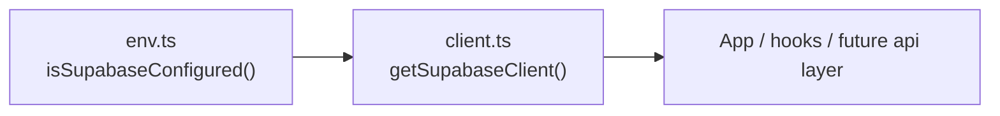
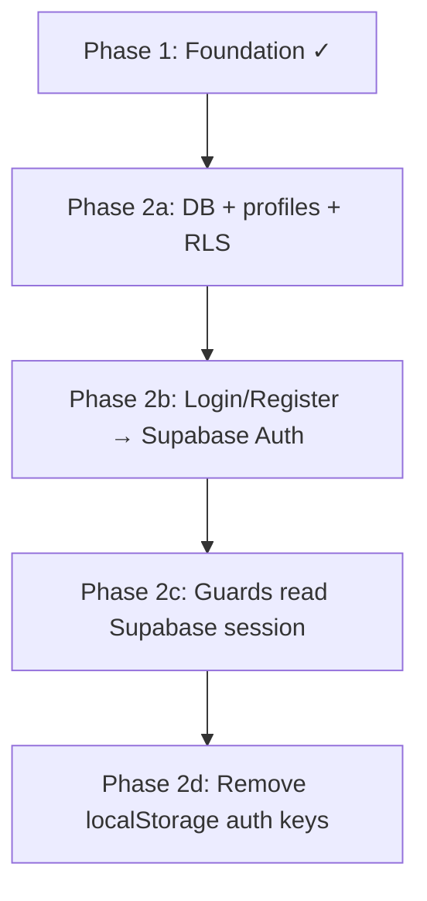

# ServdCo — Supabase Foundation (Phase 1)

Production-grade Supabase client and auth architecture for the ServdCo React frontend. This phase establishes infrastructure only — no database schema, no auth migration, no Stripe.

---

## Goals

- Environment-driven Supabase configuration (no hardcoded URLs or keys)
- Singleton typed Supabase client
- Session provider + `useAuth` hook (Supabase session only)
- React Query foundation with production caching defaults
- Full backwards compatibility with existing localStorage mock auth
- Portable to a client-owned Supabase project via env + migrations only

---

## File Map

| Path | Purpose |
|------|---------|
| `client/lib/supabase/env.ts` | Env validation, placeholder detection |
| `client/lib/supabase/client.ts` | Singleton `createClient` |
| `client/lib/supabase/types.ts` | Placeholder `Database` type + app types |
| `client/lib/supabase/index.ts` | Tree-shake friendly barrel exports |
| `client/providers/AuthProvider.tsx` | Supabase session context |
| `client/providers/QueryProvider.tsx` | React Query + devtools (dev only) |
| `client/hooks/useAuth.ts` | Supabase auth hook |
| `client/hooks/useLegacyAuth.ts` | Preserved localStorage auth hook |
| `.env.local` | Local env (gitignored) |
| `.env.example` | Committed template |

---

## Environment Variables

```bash
VITE_SUPABASE_URL=YOUR_SUPABASE_URL
VITE_SUPABASE_ANON_KEY=YOUR_SUPABASE_ANON_KEY
```

| Rule | Detail |
|------|--------|
| No hardcoded values | All access via `import.meta.env` |
| Placeholder mode | Values `YOUR_SUPABASE_*` are treated as unconfigured |
| URL validation | Must be `https://` and contain `.supabase.co` |
| Client transfer | Update `.env.local` / Vercel env vars only |

Obtain values from **Supabase Dashboard → Project Settings → API**.

---

## Supabase Client Architecture



### Singleton pattern

- `getSupabaseClient()` returns `null` when not configured (Phase 1 safe default)
- `getSupabaseClientOrThrow()` for code that requires a live connection
- `resetSupabaseClient()` clears singleton (tests, project migration)

### Auth client options

```typescript
{
  persistSession: true,
  autoRefreshToken: true,
  detectSessionInUrl: true,
}
```

---

## Auth Architecture

### Phase 1 (current) — dual auth coexistence

| Layer | Mechanism | Used by |
|-------|-----------|---------|
| **Legacy (active)** | `localStorage` + `AuthService` | Guards, Login, Register, dashboards |
| **Supabase (foundation)** | `AuthProvider` + `useAuth()` | Available but not wired to pages |

`AuthProvider` bootstraps `getSession()` and subscribes to `onAuthStateChange` when configured. It does **not** modify `localStorage` auth keys.

### `useAuth()` return shape

```typescript
{
  session,        // Supabase Session | null
  user,           // Supabase User | null
  isLoading,      // initial session resolve
  isAuthenticated,// true when Supabase session exists
  isConfigured,   // true when real env vars are set
  error,          // AuthError | null
  clearError,
}
```

### Phase 2 migration (planned, not implemented)

1. Add `profiles` table linked to `auth.users`
2. On sign-up/sign-in, upsert profile with `role`
3. Replace `AuthService.login/register` with `supabase.auth.*`
4. Update Guards to read Supabase session + profile role
5. Deprecate `useLegacyAuth` and localStorage keys

---

## Route Guards — Current Behavior & Migration Plan

Guards live in `client/components/Guards.tsx`. **Behavior unchanged in Phase 1.**

### GuestGuard

| Today | Phase 2 target |
|-------|----------------|
| Reads `localStorage.isAuthenticated` | Read `useAuth().isAuthenticated` OR legacy during transition |
| Redirects by `localStorage.userRole` | Redirect by `profiles.role` from Supabase |

### AuthGuard

| Today | Phase 2 target |
|-------|----------------|
| Blocks if `isAuthenticated !== "true"` | Block if no Supabase session |
| Redirect to `/login` | Same, with `state.from` preserved |

### RoleGuard

| Today | Phase 2 target |
|-------|----------------|
| Reads `localStorage.userRole` | Read `profiles.role` via React Query cache |
| Redirect to `/unauthorized` | Same |

### Recommended migration sequence



**Risk mitigation:** Use a feature flag `VITE_USE_SUPABASE_AUTH` in Phase 2 so Guards can support both sources during cutover.

---

## React Query Foundation

`QueryProvider` wraps the app with:

| Default | Value |
|---------|-------|
| `staleTime` | 5 minutes |
| `gcTime` | 30 minutes |
| `retry` (queries) | 1 |
| `refetchOnWindowFocus` | `false` in production |
| Devtools | Only when `import.meta.env.DEV` |

Future data hooks (Phase 2+) will use query keys like:

- `['profile', userId]`
- `['bookings', { role, userId }]`
- `['cooks', filters]`

---

## Database Architecture Overview (Phase 2+)

Not implemented in Phase 1. Planned tables:

| Table | Purpose |
|-------|---------|
| `profiles` | Extends `auth.users` with role, location, preferences |
| `cook_profiles` | Public cook marketplace data |
| `bookings` | Family ↔ cook reservations |
| `cook_documents` | Verification uploads |
| `launch_regions` | Geo launch / waitlist |
| `notifications` | Per-user alerts |
| `favorites` | Family saved cooks |
| `reviews` | Post-booking ratings |

Schema will be **migration-based** (`supabase/migrations/*.sql`) for client project transfer.

---

## Storage Strategy (Phase 2+)

| Bucket | Contents | Access |
|--------|----------|--------|
| `avatars` | Profile photos | Auth upload, public read |
| `cook-documents` | ServSafe, insurance, background check | Cook upload, admin read |
| `cook-portfolio` | Gallery images | Cook upload, public if profile public |

No bucket URLs hardcoded — use Supabase Storage SDK + signed URLs.

Current Cloudinary uploads (`UploadService`) remain until Phase 2 storage migration.

---

## Future Stripe Integration Points

Documented in `docs/servdco-stripe-backend-requirements.md`. Not implemented in Phase 1.

| Integration | Location | Phase |
|-------------|----------|-------|
| Booking checkout | Vercel `/api/stripe/checkout-session` | Phase 3 |
| Connect onboarding | Vercel `/api/stripe/connect/*` | Phase 3 |
| Webhooks | Vercel `/api/stripe/webhook` | Phase 3 |
| Premium subscription | Cook dashboard `/premium` tab | Phase 3 |

Supabase will store `stripe_customer_id`, `stripe_account_id`, and payment references on `bookings` / `cook_profiles`.

---

## Migration to Client-Owned Supabase Project

When transferring from dev Supabase to client Supabase:

1. **Database:** `supabase db dump` / run migrations on new project
2. **Storage:** `supabase storage` migration or manual bucket copy
3. **Auth:** Export users if needed, or fresh sign-ups
4. **Env:** Update `VITE_SUPABASE_URL` and `VITE_SUPABASE_ANON_KEY` in Vercel
5. **Code:** Call `resetSupabaseClient()` if hot-swapping at runtime (tests only)
6. **No code changes** required if schema matches

---

## Phase 1 Acceptance Checklist

- [x] `@supabase/supabase-js` installed
- [x] `@tanstack/react-query` installed
- [x] Supabase client singleton with env validation
- [x] `AuthProvider` + `useAuth` (not connected to Login/Register)
- [x] `QueryProvider` with devtools in dev only
- [x] Existing Guards unchanged (localStorage)
- [x] Mock API unchanged (`USE_MOCK_API: true`)
- [x] UI/routes/layouts unchanged
- [x] Build passes

---

## Next Phase (Phase 2 — not started)

1. `supabase/migrations/` — profiles, RLS policies
2. Generate `Database` types from schema
3. Wire Login/Register to `supabase.auth`
4. Migrate Guards behind feature flag
5. Replace `api.ts` mock branches incrementally
