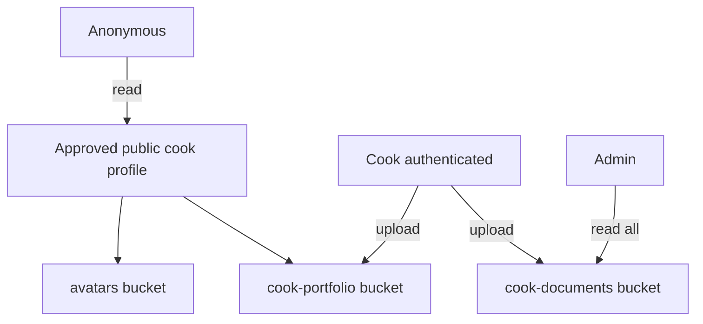
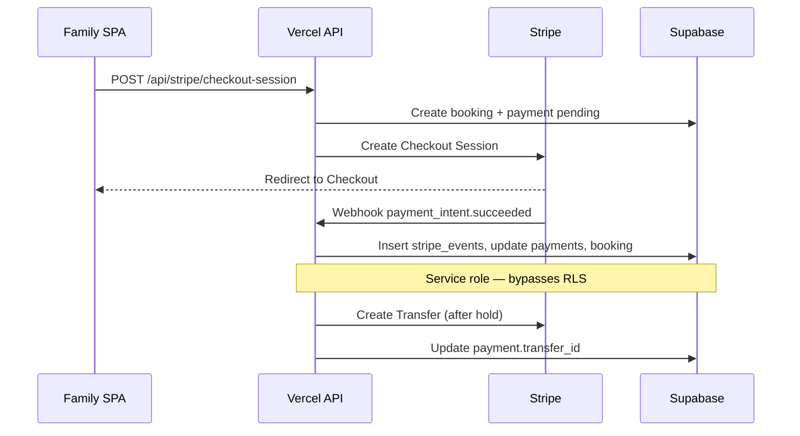

# ServdCo Phase 2 — Database Architecture & Security Design

**Status:** Architecture only — not applied to any Supabase project yet.  
**Scope:** No frontend changes. SQL migrations are ready for `supabase db push` when approved.

---

## Table of Contents

1. [ERD](#1-erd)
2. [Schema Overview](#2-schema-overview)
3. [SQL Migrations](#3-sql-migrations)
4. [Foreign Keys](#4-foreign-keys)
5. [Indexes](#5-indexes)
6. [Constraints](#6-constraints)
7. [Audit Fields](#7-audit-fields)
8. [Soft Delete Strategy](#8-soft-delete-strategy)
9. [Role Strategy](#9-role-strategy)
10. [Storage Architecture](#10-storage-architecture)
11. [RLS Architecture](#11-rls-architecture)
12. [Stripe Integration Plan](#12-stripe-integration-plan)
13. [Security Review](#13-security-review)

---

## 1. ERD

### Core identity & marketplace

```mermaid
erDiagram
  auth_users ||--|| profiles : "1:1"
  profiles ||--o| chef_profiles : "chef only 1:1"
  chef_profiles ||--o{ chef_portfolio_images : has
  chef_profiles ||--o{ chef_documents : verifies
  chef_profiles ||--o{ chef_availability : schedules
  profiles ||--o{ bookings : "family books"
  chef_profiles ||--o{ bookings : "receives"
  bookings ||--o{ booking_status_history : audits
  bookings ||--o| reviews : "one review"
  bookings ||--o| payments : "one charge"
  profiles ||--o{ favorites : saves
  chef_profiles ||--o{ favorites : "saved by"
  profiles ||--o{ notifications : receives
  profiles ||--o| stripe_customers : "family billing"
  chef_profiles ||--o| stripe_accounts : "Connect"
  chef_profiles ||--o{ subscriptions : premium
  bookings ||--o| conversations : optional
  conversations ||--o{ messages : contains

  auth_users {
    uuid id PK
  }

  profiles {
    uuid id PK_FK
    user_role role
    account_status status
    text email
    timestamptz deleted_at
  }

  chef_profiles {
    uuid id PK
    uuid user_id FK_UQ
    verification_status verification_status
    profile_visibility profile_visibility
    numeric rating
  }

  bookings {
    uuid id PK
    uuid family_id FK
    uuid chef_profile_id FK
    booking_status status
    int price_cents
  }
```

### Launch ops & public content

```mermaid
erDiagram
  launch_regions ||--o{ waitlist_signups : collects
  profiles ||--o{ waitlist_signups : "linked after signup"
  interest_requests
  contact_messages
  platform_settings
  blog_posts

  launch_regions {
    text id PK
    boolean is_active
    int chef_count
    int family_count
  }

  blog_posts {
    uuid id PK
    text slug UQ
    boolean published
  }
```

### Stripe ledger (future-ready)

```mermaid
erDiagram
  bookings ||--|| payments : charges
  profiles ||--|| stripe_customers : maps
  chef_profiles ||--|| stripe_accounts : maps
  chef_profiles ||--o{ subscriptions : premium
  stripe_events

  payments {
    uuid id PK
    text stripe_payment_intent_id UQ
    payment_status status
  }

  stripe_events {
    text stripe_event_id UQ
    boolean processed
  }
```

---

## 2. Schema Overview

### Required tables (Phase 2)

| Table | Purpose | Soft delete |
|-------|---------|-------------|
| `profiles` | All users; extends `auth.users` | `deleted_at` |
| `chef_profiles` | Cook marketplace identity | `deleted_at` |
| `chef_portfolio_images` | Gallery images | `deleted_at` |
| `bookings` | Family ↔ cook reservations | `deleted_at` |
| `booking_status_history` | Status audit trail | None (append-only) |
| `reviews` | Post-booking ratings | `deleted_at` |
| `favorites` | Family saved cooks | Hard delete |
| `notifications` | Per-user alerts | Hard delete |
| `chef_documents` | Verification uploads | `deleted_at` |
| `chef_availability` | Weekly schedule slots | `deleted_at` |
| `launch_regions` | Geo launch control | None |
| `waitlist_signups` | Pre-launch signups | None |
| `interest_requests` | City interest form | None |
| `contact_messages` | Contact form | None |
| `platform_settings` | Admin config KV | None |

### Future-ready tables

| Table | Phase | Notes |
|-------|-------|-------|
| `payments` | Stripe Phase 3 | Booking charge ledger |
| `stripe_customers` | Stripe Phase 3 | Family Stripe Customer ID |
| `stripe_accounts` | Stripe Phase 3 | Cook Connect Express |
| `stripe_events` | Stripe Phase 3 | Webhook idempotency |
| `subscriptions` | Stripe Phase 3 | Cook premium billing |
| `conversations` | Messaging Phase 4+ | Per booking/thread |
| `messages` | Messaging Phase 4+ | In-app chat |
| `blog_posts` | Content | Public published posts |

---

## 3. SQL Migrations

Migrations live in `supabase/migrations/` and must be applied in order:

| File | Contents |
|------|----------|
| `20250605120000_01_extensions_enums.sql` | Extensions, all ENUM types |
| `20250605120001_02_helper_functions.sql` | RLS helpers, `updated_at` trigger, `handle_new_user` stub |
| `20250605120002_03_core_profiles.sql` | `profiles`, `chef_profiles`, `chef_portfolio_images` |
| `20250605120003_04_marketplace_tables.sql` | Bookings, reviews, favorites, notifications, docs, availability |
| `20250605120004_05_launch_ops_tables.sql` | Regions, waitlist, interest, contact, settings, blog |
| `20250605120005_06_stripe_future_tables.sql` | Payments, Stripe tables, subscriptions |
| `20250605120006_07_messaging_future.sql` | Conversations, messages |
| `20250605120007_08_indexes.sql` | Performance indexes |
| `20250605120008_09_rls_enable.sql` | `ENABLE ROW LEVEL SECURITY` |
| `20250605120009_10_rls_policies.sql` | All RLS policies |
| `20250605120010_11_storage_buckets.sql` | Buckets + storage policies |

### Apply (when ready — not now)

```bash
supabase link --project-ref <PROJECT_REF>
supabase db push
```

### Client project transfer

1. Export migrations folder (version-controlled)
2. `supabase db push` on new project
3. Run storage object migration script (separate tooling)
4. Update `VITE_SUPABASE_URL` / `VITE_SUPABASE_ANON_KEY`

---

## 4. Foreign Keys

| Child | Parent | ON DELETE |
|-------|--------|-----------|
| `profiles.id` | `auth.users.id` | CASCADE |
| `chef_profiles.user_id` | `profiles.id` | CASCADE |
| `chef_portfolio_images.chef_profile_id` | `chef_profiles.id` | CASCADE |
| `bookings.family_id` | `profiles.id` | RESTRICT |
| `bookings.chef_profile_id` | `chef_profiles.id` | RESTRICT |
| `bookings.payment_id` | `payments.id` | SET NULL |
| `booking_status_history.booking_id` | `bookings.id` | CASCADE |
| `reviews.booking_id` | `bookings.id` | RESTRICT |
| `reviews.chef_profile_id` | `chef_profiles.id` | RESTRICT |
| `reviews.family_id` | `profiles.id` | RESTRICT |
| `favorites.family_id` | `profiles.id` | CASCADE |
| `favorites.chef_profile_id` | `chef_profiles.id` | CASCADE |
| `notifications.user_id` | `profiles.id` | CASCADE |
| `chef_documents.chef_profile_id` | `chef_profiles.id` | CASCADE |
| `chef_availability.chef_profile_id` | `chef_profiles.id` | CASCADE |
| `waitlist_signups.region_id` | `launch_regions.id` | SET NULL |
| `waitlist_signups.profile_id` | `profiles.id` | SET NULL |
| `stripe_customers.profile_id` | `profiles.id` | CASCADE |
| `stripe_accounts.chef_profile_id` | `chef_profiles.id` | CASCADE |
| `payments.booking_id` | `bookings.id` | RESTRICT |
| `subscriptions.chef_profile_id` | `chef_profiles.id` | CASCADE |
| `conversations.family_id` | `profiles.id` | CASCADE |
| `conversations.chef_profile_id` | `chef_profiles.id` | CASCADE |
| `messages.conversation_id` | `conversations.id` | CASCADE |
| `messages.sender_id` | `profiles.id` | CASCADE |

**Design choice:** `RESTRICT` on bookings/reviews/payments prevents accidental orphaning of financial records.

---

## 5. Indexes

See `20250605120007_08_indexes.sql`. Highlights:

- **Partial indexes** on `deleted_at IS NULL` for active-record queries
- **Composite indexes** aligned to dashboard queries (`family_id + status`, `chef_profile_id + status`)
- **Public listing index** on `chef_profiles` filtered to approved + public
- **Webhook processing** index on unprocessed `stripe_events`
- **Unread notifications** partial index

---

## 6. Constraints

| Type | Examples |
|------|----------|
| CHECK | `rating` 1–5, `profile_completed` 0–100, `guests_count >= 1` |
| CHECK | `price_cents >= 0`, fee fields non-negative |
| CHECK | `day_of_week` 0–6, `effective_until >= effective_from` |
| UNIQUE | `reviews.booking_id` (one review per booking) |
| UNIQUE | `favorites (family_id, chef_profile_id)` |
| UNIQUE | `chef_profiles.user_id` (one cook profile per user) |
| UNIQUE | `stripe_*` external IDs |
| UNIQUE | `waitlist_signups (email, region_id, role)` |
| UNIQUE | Storage path per bucket on documents/portfolio |
| ENUM | All status/role fields typed — no free-text drift |

---

## 7. Audit Fields

| Pattern | Tables |
|---------|--------|
| `created_at`, `updated_at` | All mutable tables |
| `created_by`, `updated_by` | `profiles`, `chef_profiles`, `bookings` |
| `deleted_at`, `deleted_by` | Soft-deletable entities |
| Append-only history | `booking_status_history`, `stripe_events` |
| `handled_by` | `contact_messages` |
| `reviewed_by`, `reviewed_at` | `chef_documents` |
| `changed_by`, `reason` | `booking_status_history` |

**Trigger:** `set_updated_at()` on BEFORE UPDATE for all tables with `updated_at`.

**Phase 3 recommendation:** Add `audit_log` table + trigger for admin-sensitive changes (role changes, document approval, payout overrides).

---

## 8. Soft Delete Strategy

| Approach | Detail |
|----------|--------|
| Mechanism | `deleted_at timestamptz` + optional `deleted_by` |
| Queries | All RLS policies include `deleted_at IS NULL` where applicable |
| Hard delete | Avoided for users, bookings, reviews, payments |
| Exceptions | `favorites` (toggle), `notifications` (dismiss), append-only tables |
| Admin recovery | Admin can set `deleted_at = NULL` via service workflow |
| Storage | Soft-deleted DB rows retain `storage_path`; GC job deletes orphaned objects |

**Never expose** soft-deleted cook profiles publicly — `is_public_chef_profile()` checks `deleted_at IS NULL`.

---

## 9. Role Strategy

### Single source of truth

```
auth.users  →  profiles.role  →  RLS helpers
```

| Role | `profiles.role` | Capabilities |
|------|-----------------|--------------|
| Family | `family` | Own profile, bookings, favorites, notifications |
| Cook | `chef` | Own `chef_profiles` row + related tables |
| Admin | `admin` | Full read/write via `is_admin()` policies |

### Assignment rules (Phase 3 auth migration)

| Event | Role set |
|-------|----------|
| `/register/family` | `family` in `raw_user_meta_data` → `handle_new_user()` |
| `/register/chef` | `chef` + create `chef_profiles` row |
| Admin promotion | Manual SQL or admin panel (service role) — **never** client-writable |

### RLS helpers (SECURITY DEFINER)

- `get_user_role()` — reads `profiles.role` for `auth.uid()`
- `is_admin()`, `is_family()`, `is_chef()`
- `owns_chef_profile(uuid)` — cook ownership
- `is_public_chef_profile(uuid)` — anonymous browse gate

**No role in JWT custom claims initially** — keeps migration portable. Optional later: sync role to `app_metadata` for edge functions.

---

## 10. Storage Architecture

### Buckets

| Bucket | Public | Max size | MIME types | Path convention |
|--------|--------|----------|------------|-----------------|
| `avatars` | Yes | 5 MB | jpeg, png, webp, gif | `{user_id}/{file}` |
| `cook-portfolio` | Conditional | 10 MB | jpeg, png, webp | `{chef_profile_id}/{file}` |
| `cook-documents` | No | 20 MB | pdf, jpeg, png | `{chef_profile_id}/{doc_type}/{file}` |

### Access model



### DB ↔ Storage linkage

- `chef_portfolio_images.storage_path` ↔ `cook-portfolio` object key
- `chef_documents.storage_path` ↔ `cook-documents` object key
- `profiles.avatar_url` — public URL from `avatars` bucket (or CDN)

### Cloudinary coexistence (Phase 3)

Existing frontend uses Cloudinary (`UploadService`). Migration path:

1. New uploads → Supabase Storage
2. Backfill existing URLs into DB as `public_url` legacy field
3. Deprecate Cloudinary preset after cutover

### Client project transfer

Use `supabase storage cp` or custom migration script — no hardcoded bucket URLs in code.

---

## 11. RLS Architecture

### Policy matrix (summary)

| Table | anon | family | chef | admin |
|-------|------|--------|------|-------|
| `profiles` | — | own | own | all |
| `chef_profiles` | public approved | public + own | own | all |
| `chef_portfolio_images` | public approved | public + own | own | all |
| `bookings` | — | own | assigned | all |
| `reviews` | public per cook | own + public | own + public | all |
| `favorites` | — | own | — | all |
| `notifications` | — | own | own | insert all |
| `chef_documents` | — | — | own | all |
| `chef_availability` | public approved | public | own | all |
| `launch_regions` | read | read | read | write |
| `waitlist_signups` | insert | insert + own | insert + own | read |
| `interest_requests` | insert | insert | insert | read |
| `contact_messages` | insert | insert | insert | all |
| `platform_settings` | fee keys | fee keys | fee keys | all |
| `blog_posts` | published | published | published | all |
| `payments` | — | own | own | all |
| `stripe_events` | — | — | — | read (write: service role) |

### Service role bypass

These operations **must** use Vercel serverless with `SUPABASE_SERVICE_ROLE_KEY`:

- Stripe webhook → `stripe_events`, `payments` updates
- Create Stripe Customer / Connect account records
- System notifications (booking confirmed, etc.)
- Admin bulk operations
- `handle_new_user` edge cases

### Public access (explicit allow list)

Only these are readable without authentication:

1. Approved + public `chef_profiles`
2. Public portfolio images for public cooks
3. Public availability for public cooks
4. Reviews on public cook profiles
5. Published `blog_posts`
6. `launch_regions` (waitlist UI)
7. Public `platform_settings` keys (fee display)

**Everything else requires `authenticated`.**

---

## 12. Stripe Integration Plan

Aligned with `docs/servdco-stripe-backend-requirements.md`. **Not implemented in Phase 2.**

### Data flow



### Table usage

| Stripe object | DB table | Key column |
|---------------|----------|------------|
| Customer | `stripe_customers` | `stripe_customer_id` |
| Connect Account | `stripe_accounts` | `stripe_account_id` |
| PaymentIntent | `payments` | `stripe_payment_intent_id` |
| Subscription | `subscriptions` | `stripe_subscription_id` |
| Webhook event | `stripe_events` | `stripe_event_id` (dedupe) |

### Vercel endpoints (Phase 3)

| Endpoint | Purpose |
|----------|---------|
| `POST /api/stripe/checkout-session` | Booking payment |
| `POST /api/stripe/webhook` | All webhook events |
| `POST /api/stripe/connect/create-account` | Cook onboarding |
| `GET /api/stripe/connect/account-link` | Express onboarding URL |
| `POST /api/stripe/subscription/checkout` | Cook premium |

### Secrets (Vercel only — never in frontend)

- `STRIPE_SECRET_KEY`
- `STRIPE_WEBHOOK_SECRET`
- `SUPABASE_SERVICE_ROLE_KEY`

---

## 13. Security Review

### Strengths

| Control | Implementation |
|---------|----------------|
| RLS on all tables | Enabled + forced on sensitive tables |
| Role isolation | Helper functions avoid policy duplication |
| Public surface minimized | Explicit `is_public_chef_profile()` gate |
| Financial integrity | RESTRICT FKs, append-only event log |
| Webhook idempotency | `stripe_events.stripe_event_id` UNIQUE |
| Storage path isolation | Folder prefix = `auth.uid()` or `chef_profile_id` |
| No secrets in schema | Env-driven only |
| Portable migrations | Version-controlled SQL |

### Risks & mitigations

| Risk | Severity | Mitigation (Phase 3+) |
|------|----------|----------------------|
| Admin role self-elevation | High | No client UPDATE on `profiles.role`; admin via service role only |
| Anon spam on waitlist/contact | Medium | Rate limiting in Edge Function + CAPTCHA |
| `is_admin()` SECURITY DEFINER | Medium | Keep function minimal; audit grants |
| Cook documents readable by chef only | Low | Correct — admin uses separate policy |
| Storage path UUID cast errors | Medium | Validate folder name format in upload Edge Function |
| Dual auth during migration | High | Feature flag; don't enable RLS-backed routes until cutover |
| `stripe_events` no INSERT policy | Low | Intentional — service role only |
| Premium status drift | Medium | Sync `chef_profiles.premium_status` from `subscriptions` via webhook |

### Pre-launch checklist (before applying migrations)

- [ ] Review all RLS policies in staging project
- [ ] Test anon cannot read `bookings`, `notifications`, `chef_documents`
- [ ] Test family cannot read other family bookings
- [ ] Test cook cannot read other cook documents
- [ ] Test admin can access all admin dashboard tables
- [ ] Verify storage policies with test uploads
- [ ] Pen-test webhook endpoint (signature verification)
- [ ] Enable Supabase Auth email confirmation before production bookings

### Compliance notes

- `chef_documents` may contain PII — private bucket, admin-only review
- `contact_messages` retention policy needed (GDPR delete requests)
- Soft-deleted users: anonymize `email` in `profiles` on hard GDPR delete

---

## Files Produced (Phase 2)

```
supabase/migrations/
  20250605120000_01_extensions_enums.sql
  20250605120001_02_helper_functions.sql
  20250605120002_03_core_profiles.sql
  20250605120003_04_marketplace_tables.sql
  20250605120004_05_launch_ops_tables.sql
  20250605120005_06_stripe_future_tables.sql
  20250605120006_07_messaging_future.sql
  20250605120007_08_indexes.sql
  20250605120008_09_rls_enable.sql
  20250605120009_10_rls_policies.sql
  20250605120010_11_storage_buckets.sql

docs/supabase-phase2-database-architecture.md  (this file)
supabase/README.md
```

**No frontend files were modified.**
